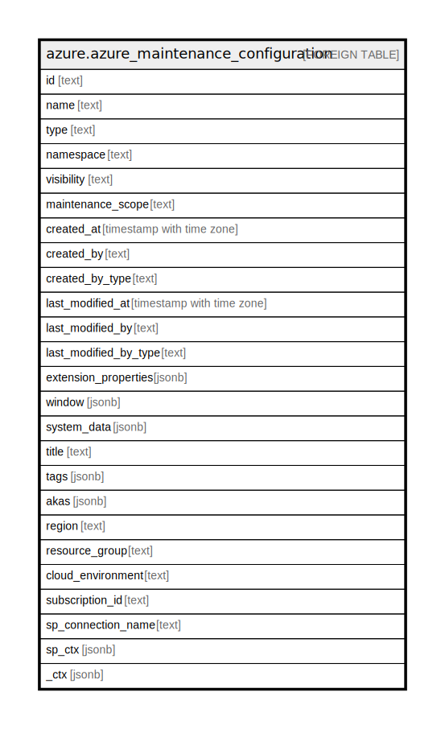

# azure.azure_maintenance_configuration

## Description

Azure Maintenance Configuration.

## Columns

| Name | Type | Default | Nullable | Children | Parents | Comment |
| ---- | ---- | ------- | -------- | -------- | ------- | ------- |
| id | text |  | true |  |  | Fully qualified identifier of the resource. |
| name | text |  | true |  |  | Name of the resource. |
| type | text |  | true |  |  | The type of the resource. |
| namespace | text |  | true |  |  | Gets or sets namespace of the resource. |
| visibility | text |  | true |  |  | The visibility of the configuration. The default value is 'Custom'. Possible values include: 'VisibilityCustom', 'VisibilityPublic'. |
| maintenance_scope | text |  | true |  |  | The maintenanceScope of the configuration. Possible values include: 'ScopeHost', 'ScopeOSImage', 'ScopeExtension', 'ScopeInGuestPatch', 'ScopeSQLDB', 'ScopeSQLManagedInstance'. |
| created_at | timestamp with time zone |  | true |  |  | The timestamp of resource creation (UTC). |
| created_by | text |  | true |  |  | The identity that created the resource. |
| created_by_type | text |  | true |  |  | The type of identity that created the resource. Possible values include: 'CreatedByTypeUser', 'CreatedByTypeApplication', 'CreatedByTypeManagedIdentity', 'CreatedByTypeKey'. |
| last_modified_at | timestamp with time zone |  | true |  |  | The timestamp of resource last modification (UTC). |
| last_modified_by | text |  | true |  |  | The identity that last modified the resource. |
| last_modified_by_type | text |  | true |  |  | The type of identity that last modified the resource. Possible values include: 'CreatedByTypeUser', 'CreatedByTypeApplication', 'CreatedByTypeManagedIdentity', 'CreatedByTypeKey'. |
| extension_properties | jsonb |  | true |  |  | Gets or sets extensionProperties of the maintenanceConfiguration. |
| window | jsonb |  | true |  |  | Definition of a MaintenanceWindow. |
| system_data | jsonb |  | true |  |  | Azure Resource Manager metadata containing createdBy and modifiedBy information. |
| title | text |  | true |  |  | Title of the resource. |
| tags | jsonb |  | true |  |  | A map of tags for the resource. |
| akas | jsonb |  | true |  |  | Array of globally unique identifier strings (also known as) for the resource. |
| region | text |  | true |  |  | The Azure region/location in which the resource is located. |
| resource_group | text |  | true |  |  | The resource group which holds this resource. |
| cloud_environment | text |  | true |  |  | The Azure Cloud Environment. |
| subscription_id | text |  | true |  |  | The Azure Subscription ID in which the resource is located. |
| sp_connection_name | text |  | true |  |  | Steampipe connection name. |
| sp_ctx | jsonb |  | true |  |  | Steampipe context in JSON form. |
| _ctx | jsonb |  | true |  |  | Steampipe context in JSON form. |

## Relations

---

> Generated by [tbls](https://github.com/k1LoW/tbls)
