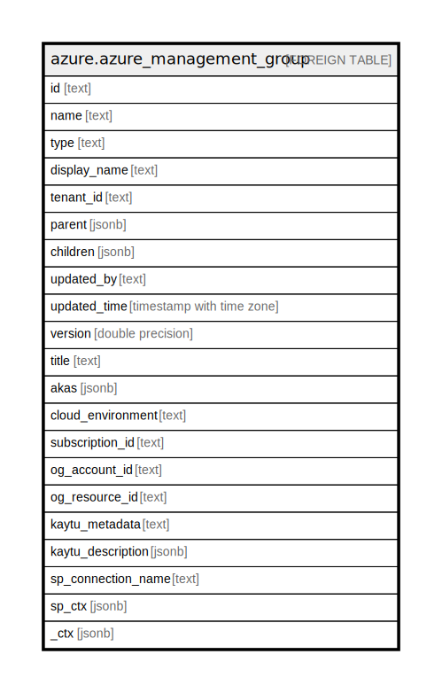

# azure.azure_management_group

## Description

Azure Management Group.

## Columns

| Name | Type | Default | Nullable | Children | Parents | Comment |
| ---- | ---- | ------- | -------- | -------- | ------- | ------- |
| id | text |  | true |  |  | The fully qualified ID for the management group. |
| name | text |  | true |  |  | The name of the management group. |
| type | text |  | true |  |  | The type of the management group. |
| display_name | text |  | true |  |  | The friendly name of the management group. |
| tenant_id | text |  | true |  |  | The AAD Tenant ID associated with the management group. |
| parent | jsonb |  | true |  |  | The associated parent management group. |
| children | jsonb |  | true |  |  | The list of children of the management group. |
| updated_by | text |  | true |  |  | The identity of the principal or process that updated the management group. |
| updated_time | timestamp with time zone |  | true |  |  | The date and time when this management group was last updated. |
| version | double precision |  | true |  |  | The version number of the management group. |
| title | text |  | true |  |  | Title of the resource. |
| akas | jsonb |  | true |  |  | Array of globally unique identifier strings (also known as) for the resource. |
| cloud_environment | text |  | true |  |  | The Azure Cloud Environment. |
| subscription_id | text |  | true |  |  | The Azure Subscription ID in which the resource is located. |
| og_account_id | text |  | true |  |  | The Platform Account ID in which the resource is located. |
| og_resource_id | text |  | true |  |  | The unique ID of the resource in opengovernance. |
| kaytu_metadata | text |  | true |  |  | Platform Metadata of the Azure resource. |
| kaytu_description | jsonb |  | true |  |  | The full model description of the resource |
| sp_connection_name | text |  | true |  |  | Steampipe connection name. |
| sp_ctx | jsonb |  | true |  |  | Steampipe context in JSON form. |
| _ctx | jsonb |  | true |  |  | Steampipe context in JSON form. |

## Relations

---

> Generated by [tbls](https://github.com/k1LoW/tbls)
