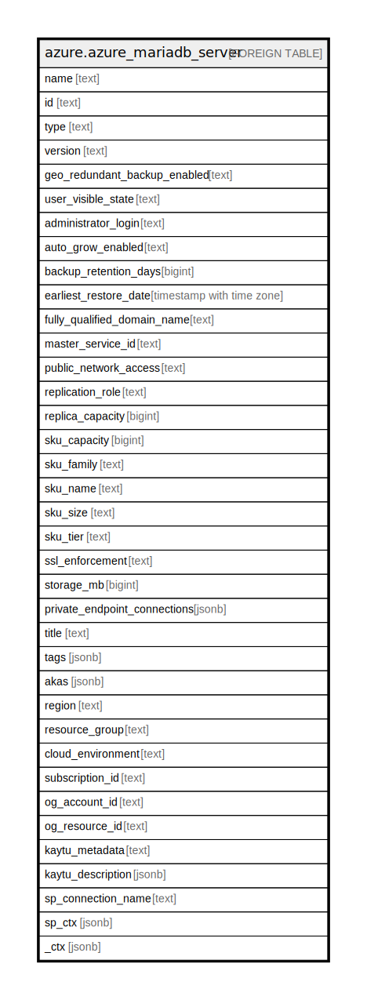

# azure.azure_mariadb_server

## Description

Azure MariaDB Server

## Columns

| Name | Type | Default | Nullable | Children | Parents | Comment |
| ---- | ---- | ------- | -------- | -------- | ------- | ------- |
| name | text |  | true |  |  | The name of the resource. |
| id | text |  | true |  |  | A fully qualified resource ID for the resource. |
| type | text |  | true |  |  | The type of the resource. |
| version | text |  | true |  |  | Specifies the server version. |
| geo_redundant_backup_enabled | text |  | true |  |  | Indicates whether geo-redundant backup is enabled for server backup, or not. |
| user_visible_state | text |  | true |  |  | A state of a server that is visible to user. Valid values are: 'Ready', 'Dropping', 'Disabled'. |
| administrator_login | text |  | true |  |  | The administrator's login name of a server. |
| auto_grow_enabled | text |  | true |  |  | Indicates whether storage auto grow is enabled for server, or not. |
| backup_retention_days | bigint |  | true |  |  | Specifies the backup retention days for the server. |
| earliest_restore_date | timestamp with time zone |  | true |  |  | Specifies the earliest restore point creation time. |
| fully_qualified_domain_name | text |  | true |  |  | The fully qualified domain name of a server. |
| master_service_id | text |  | true |  |  | The master server id of a replica server. |
| public_network_access | text |  | true |  |  | Indicates whether or not public network access is allowed for this server. Valid values are: 'Enabled', 'Disabled'. |
| replication_role | text |  | true |  |  | The replication role of the server. |
| replica_capacity | bigint |  | true |  |  | The maximum number of replicas that a master server can have. |
| sku_capacity | bigint |  | true |  |  | The scale up/out capacity, representing server's compute units. |
| sku_family | text |  | true |  |  | The family of hardware. |
| sku_name | text |  | true |  |  | The name of the sku. |
| sku_size | text |  | true |  |  | The size code, to be interpreted by resource as appropriate. |
| sku_tier | text |  | true |  |  | The tier of the particular SKU. Valid values are: 'Basic', 'GeneralPurpose', 'MemoryOptimized'. |
| ssl_enforcement | text |  | true |  |  | Indicates whether SSL enforcement is enabled, or not. Valid values are: 'Enabled', and 'Disabled'. |
| storage_mb | bigint |  | true |  |  | Specifies the max storage allowed for a server. |
| private_endpoint_connections | jsonb |  | true |  |  | A list of private endpoint connections on a server. |
| title | text |  | true |  |  | Title of the resource. |
| tags | jsonb |  | true |  |  | A map of tags for the resource. |
| akas | jsonb |  | true |  |  | Array of globally unique identifier strings (also known as) for the resource. |
| region | text |  | true |  |  | The Azure region/location in which the resource is located. |
| resource_group | text |  | true |  |  | The resource group which holds this resource. |
| cloud_environment | text |  | true |  |  | The Azure Cloud Environment. |
| subscription_id | text |  | true |  |  | The Azure Subscription ID in which the resource is located. |
| og_account_id | text |  | true |  |  | The Platform Account ID in which the resource is located. |
| og_resource_id | text |  | true |  |  | The unique ID of the resource in opengovernance. |
| kaytu_metadata | text |  | true |  |  | Platform Metadata of the Azure resource. |
| kaytu_description | jsonb |  | true |  |  | The full model description of the resource |
| sp_connection_name | text |  | true |  |  | Steampipe connection name. |
| sp_ctx | jsonb |  | true |  |  | Steampipe context in JSON form. |
| _ctx | jsonb |  | true |  |  | Steampipe context in JSON form. |

## Relations

---

> Generated by [tbls](https://github.com/k1LoW/tbls)
