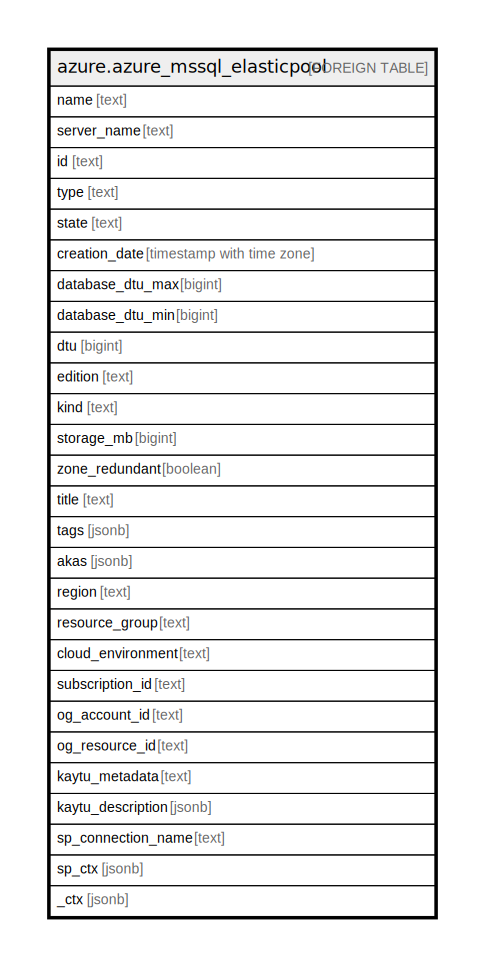

# azure.azure_mssql_elasticpool

## Description

Azure Microsoft SQL Elastic Pool

## Columns

| Name | Type | Default | Nullable | Children | Parents | Comment |
| ---- | ---- | ------- | -------- | -------- | ------- | ------- |
| name | text |  | true |  |  | The friendly name that identifies the elastic pool. |
| server_name | text |  | true |  |  | The name of the parent server of the elastic pool. |
| id | text |  | true |  |  | Contains ID to identify a elastic pool uniquely. |
| type | text |  | true |  |  | The resource type of the elastic pool. |
| state | text |  | true |  |  | The state of the elastic pool. |
| creation_date | timestamp with time zone |  | true |  |  | The creation date of the elastic pool. |
| database_dtu_max | bigint |  | true |  |  | The maximum DTU any one database can consume. |
| database_dtu_min | bigint |  | true |  |  | The minimum DTU all databases are guaranteed. |
| dtu | bigint |  | true |  |  | The total shared DTU for the database elastic pool. |
| edition | text |  | true |  |  | The edition of the elastic pool. |
| kind | text |  | true |  |  | The kind of elastic pool. |
| storage_mb | bigint |  | true |  |  | Storage limit for the database elastic pool in MB. |
| zone_redundant | boolean |  | true |  |  | Whether or not this database elastic pool is zone redundant, which means the replicas of this database will be spread across multiple availability zones. |
| title | text |  | true |  |  | Title of the resource. |
| tags | jsonb |  | true |  |  | A map of tags for the resource. |
| akas | jsonb |  | true |  |  | Array of globally unique identifier strings (also known as) for the resource. |
| region | text |  | true |  |  | The Azure region/location in which the resource is located. |
| resource_group | text |  | true |  |  | The resource group which holds this resource. |
| cloud_environment | text |  | true |  |  | The Azure Cloud Environment. |
| subscription_id | text |  | true |  |  | The Azure Subscription ID in which the resource is located. |
| og_account_id | text |  | true |  |  | The Platform Account ID in which the resource is located. |
| og_resource_id | text |  | true |  |  | The unique ID of the resource in opengovernance. |
| kaytu_metadata | text |  | true |  |  | Platform Metadata of the Azure resource. |
| kaytu_description | jsonb |  | true |  |  | The full model description of the resource |
| sp_connection_name | text |  | true |  |  | Steampipe connection name. |
| sp_ctx | jsonb |  | true |  |  | Steampipe context in JSON form. |
| _ctx | jsonb |  | true |  |  | Steampipe context in JSON form. |

## Relations

---

> Generated by [tbls](https://github.com/k1LoW/tbls)
