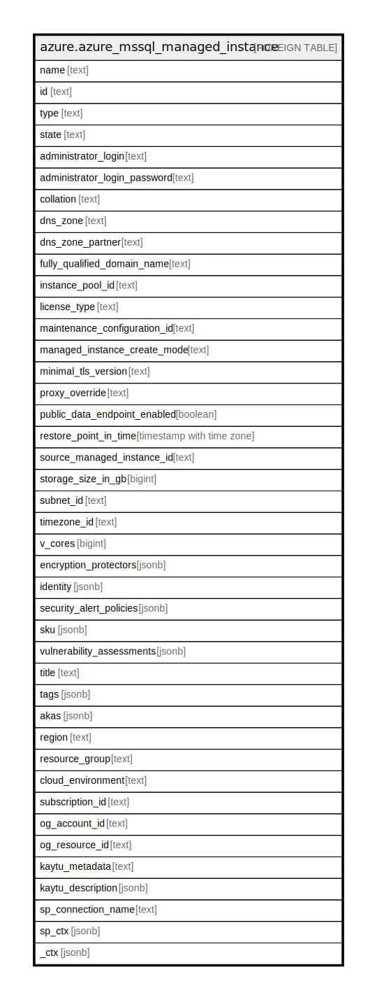

# azure.azure_mssql_managed_instance

## Description

Azure Microsoft SQL Managed Instance

## Columns

| Name | Type | Default | Nullable | Children | Parents | Comment |
| ---- | ---- | ------- | -------- | -------- | ------- | ------- |
| name | text |  | true |  |  | The friendly name that identifies the managed instance. |
| id | text |  | true |  |  | Contains ID to identify a managed instance uniquely. |
| type | text |  | true |  |  | The resource type of the managed instance. |
| state | text |  | true |  |  | The state of the managed instance. |
| administrator_login | text |  | true |  |  | Administrator username for the managed instance. |
| administrator_login_password | text |  | true |  |  | Administrator password for the managed instance. |
| collation | text |  | true |  |  | Collation of the managed instance. |
| dns_zone | text |  | true |  |  | The Dns zone that the managed instance is in. |
| dns_zone_partner | text |  | true |  |  | The resource id of another managed instance whose DNS zone this managed instance will share after creation. |
| fully_qualified_domain_name | text |  | true |  |  | The fully qualified domain name of the managed instance. |
| instance_pool_id | text |  | true |  |  | The Id of the instance pool this managed server belongs to. |
| license_type | text |  | true |  |  | The license type of the managed instance. |
| maintenance_configuration_id | text |  | true |  |  | Specifies maintenance configuration id to apply to this managed instance. |
| managed_instance_create_mode | text |  | true |  |  | Specifies the mode of database creation. |
| minimal_tls_version | text |  | true |  |  | Minimal TLS version of the managed instance. |
| proxy_override | text |  | true |  |  | Connection type used for connecting to the instance. |
| public_data_endpoint_enabled | boolean |  | true |  |  | Whether or not the public data endpoint is enabled. |
| restore_point_in_time | timestamp with time zone |  | true |  |  | Specifies the point in time of the source database that will be restored to create the new database. |
| source_managed_instance_id | text |  | true |  |  | The resource identifier of the source managed instance associated with create operation of this instance. |
| storage_size_in_gb | bigint |  | true |  |  | The managed instance storage size in GB. |
| subnet_id | text |  | true |  |  | Subnet resource ID for the managed instance. |
| timezone_id | text |  | true |  |  | Id of the timezone. |
| v_cores | bigint |  | true |  |  | The number of vcores of the managed instance. |
| encryption_protectors | jsonb |  | true |  |  | The managed instance encryption protectors. |
| identity | jsonb |  | true |  |  | The azure active directory identity of the managed instance. |
| security_alert_policies | jsonb |  | true |  |  | The security alert policies of the managed instance. |
| sku | jsonb |  | true |  |  | Managed instance SKU. |
| vulnerability_assessments | jsonb |  | true |  |  | The managed instance vulnerability assessments. |
| title | text |  | true |  |  | Title of the resource. |
| tags | jsonb |  | true |  |  | A map of tags for the resource. |
| akas | jsonb |  | true |  |  | Array of globally unique identifier strings (also known as) for the resource. |
| region | text |  | true |  |  | The Azure region/location in which the resource is located. |
| resource_group | text |  | true |  |  | The resource group which holds this resource. |
| cloud_environment | text |  | true |  |  | The Azure Cloud Environment. |
| subscription_id | text |  | true |  |  | The Azure Subscription ID in which the resource is located. |
| og_account_id | text |  | true |  |  | The Platform Account ID in which the resource is located. |
| og_resource_id | text |  | true |  |  | The unique ID of the resource in opengovernance. |
| kaytu_metadata | text |  | true |  |  | Platform Metadata of the Azure resource. |
| kaytu_description | jsonb |  | true |  |  | The full model description of the resource |
| sp_connection_name | text |  | true |  |  | Steampipe connection name. |
| sp_ctx | jsonb |  | true |  |  | Steampipe context in JSON form. |
| _ctx | jsonb |  | true |  |  | Steampipe context in JSON form. |

## Relations

---

> Generated by [tbls](https://github.com/k1LoW/tbls)
