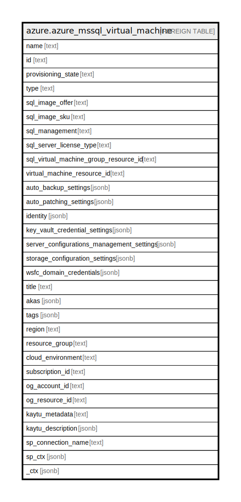

# azure.azure_mssql_virtual_machine

## Description

Azure MS SQL Virtual Machine

## Columns

| Name | Type | Default | Nullable | Children | Parents | Comment |
| ---- | ---- | ------- | -------- | -------- | ------- | ------- |
| name | text |  | true |  |  | The resource name. |
| id | text |  | true |  |  | The resource ID. |
| provisioning_state | text |  | true |  |  | Provisioning state to track the async operation status. |
| type | text |  | true |  |  | The resource type. |
| sql_image_offer | text |  | true |  |  | SQL image offer for the SQL virtual machine. |
| sql_image_sku | text |  | true |  |  | SQL Server edition type. Possible values include: 'Developer', 'Express', 'Standard', 'Enterprise', 'Web'. |
| sql_management | text |  | true |  |  | SQL Server Management type. Possible values include: 'Full', 'LightWeight', 'NoAgent'. |
| sql_server_license_type | text |  | true |  |  | SQL server license type for the SQL virtual machine. Possible values include: 'PAYG', 'AHUB', 'DR'. |
| sql_virtual_machine_group_resource_id | text |  | true |  |  | ARM resource id of the SQL virtual machine group this SQL virtual machine is or will be part of. |
| virtual_machine_resource_id | text |  | true |  |  | ARM resource id of underlying virtual machine created from SQL marketplace image. |
| auto_backup_settings | jsonb |  | true |  |  | Auto backup settings for SQL Server. |
| auto_patching_settings | jsonb |  | true |  |  | Auto patching settings for applying critical security updates to SQL virtual machine. |
| identity | jsonb |  | true |  |  | Azure Active Directory identity for the SQL virtual machine. |
| key_vault_credential_settings | jsonb |  | true |  |  | Key vault credential settings for the SQL virtual machine. |
| server_configurations_management_settings | jsonb |  | true |  |  | SQL server configuration management settings for the SQL virtual machine. |
| storage_configuration_settings | jsonb |  | true |  |  | Storage configuration settings for the SQL virtual machine. |
| wsfc_domain_credentials | jsonb |  | true |  |  | Domain credentials for setting up Windows Server Failover Cluster for SQL availability group. |
| title | text |  | true |  |  | Title of the resource. |
| akas | jsonb |  | true |  |  | Array of globally unique identifier strings (also known as) for the resource. |
| tags | jsonb |  | true |  |  | A map of tags for the resource. |
| region | text |  | true |  |  | The Azure region/location in which the resource is located. |
| resource_group | text |  | true |  |  | The resource group which holds this resource. |
| cloud_environment | text |  | true |  |  | The Azure Cloud Environment. |
| subscription_id | text |  | true |  |  | The Azure Subscription ID in which the resource is located. |
| og_account_id | text |  | true |  |  | The Platform Account ID in which the resource is located. |
| og_resource_id | text |  | true |  |  | The unique ID of the resource in opengovernance. |
| kaytu_metadata | text |  | true |  |  | Platform Metadata of the Azure resource. |
| kaytu_description | jsonb |  | true |  |  | The full model description of the resource |
| sp_connection_name | text |  | true |  |  | Steampipe connection name. |
| sp_ctx | jsonb |  | true |  |  | Steampipe context in JSON form. |
| _ctx | jsonb |  | true |  |  | Steampipe context in JSON form. |

## Relations

---

> Generated by [tbls](https://github.com/k1LoW/tbls)
