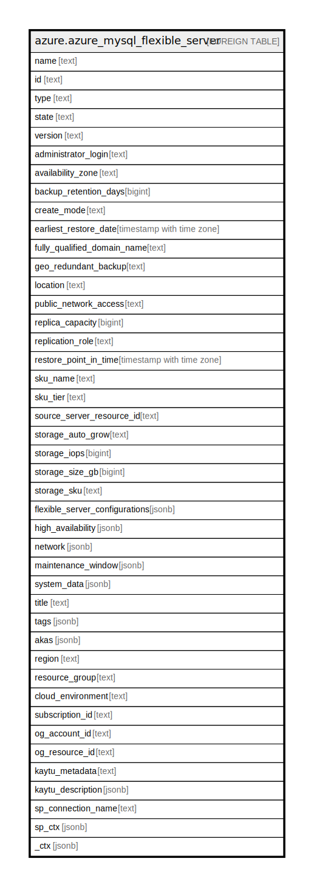

# azure.azure_mysql_flexible_server

## Description

Azure MySQL Flexible Server

## Columns

| Name | Type | Default | Nullable | Children | Parents | Comment |
| ---- | ---- | ------- | -------- | -------- | ------- | ------- |
| name | text |  | true |  |  | The friendly name that identifies the server. |
| id | text |  | true |  |  | Contains ID to identify a server uniquely. |
| type | text |  | true |  |  | The resource type of the server. |
| state | text |  | true |  |  | The state of the server. |
| version | text |  | true |  |  | Specifies the version of the server. |
| administrator_login | text |  | true |  |  | The administrator's login name of a server. |
| availability_zone | text |  | true |  |  | Availability Zone information of the server. |
| backup_retention_days | bigint |  | true |  |  | Backup retention days for the server. |
| create_mode | text |  | true |  |  | The mode to create a new server. |
| earliest_restore_date | timestamp with time zone |  | true |  |  | Specifies the earliest restore point creation time. |
| fully_qualified_domain_name | text |  | true |  |  | The fully qualified domain name of the server. |
| geo_redundant_backup | text |  | true |  |  | Indicates whether Geo-redundant is enabled, or not for server backup. |
| location | text |  | true |  |  | The server location. |
| public_network_access | text |  | true |  |  | Whether or not public network access is allowed for this server. |
| replica_capacity | bigint |  | true |  |  | The maximum number of replicas that a primary server can have. |
| replication_role | text |  | true |  |  | The replication role of the server. |
| restore_point_in_time | timestamp with time zone |  | true |  |  | Restore point creation time (ISO8601 format), specifying the time to restore from. |
| sku_name | text |  | true |  |  | The name of the sku. |
| sku_tier | text |  | true |  |  | The tier of the particular SKU. |
| source_server_resource_id | text |  | true |  |  | The source MySQL server id. |
| storage_auto_grow | text |  | true |  |  | Indicates whether storage auto grow is enabled, or not. |
| storage_iops | bigint |  | true |  |  | Storage IOPS for a server. |
| storage_size_gb | bigint |  | true |  |  | Indicates max storage allowed for a server. |
| storage_sku | text |  | true |  |  | The sku name of the server storage. |
| flexible_server_configurations | jsonb |  | true |  |  | The server configurations(parameters) details of the server. |
| high_availability | jsonb |  | true |  |  | High availability related properties of a server. |
| network | jsonb |  | true |  |  | Network related properties of a server. |
| maintenance_window | jsonb |  | true |  |  | Maintenance window of a server. |
| system_data | jsonb |  | true |  |  | The system metadata relating to this server. |
| title | text |  | true |  |  | Title of the resource. |
| tags | jsonb |  | true |  |  | A map of tags for the resource. |
| akas | jsonb |  | true |  |  | Array of globally unique identifier strings (also known as) for the resource. |
| region | text |  | true |  |  | The Azure region/location in which the resource is located. |
| resource_group | text |  | true |  |  | The resource group which holds this resource. |
| cloud_environment | text |  | true |  |  | The Azure Cloud Environment. |
| subscription_id | text |  | true |  |  | The Azure Subscription ID in which the resource is located. |
| og_account_id | text |  | true |  |  | The Platform Account ID in which the resource is located. |
| og_resource_id | text |  | true |  |  | The unique ID of the resource in opengovernance. |
| kaytu_metadata | text |  | true |  |  | Platform Metadata of the Azure resource. |
| kaytu_description | jsonb |  | true |  |  | The full model description of the resource |
| sp_connection_name | text |  | true |  |  | Steampipe connection name. |
| sp_ctx | jsonb |  | true |  |  | Steampipe context in JSON form. |
| _ctx | jsonb |  | true |  |  | Steampipe context in JSON form. |

## Relations

---

> Generated by [tbls](https://github.com/k1LoW/tbls)
