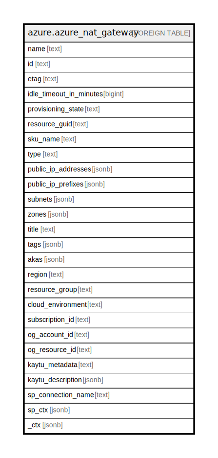

# azure.azure_nat_gateway

## Description

Azure NAT Gateway

## Columns

| Name | Type | Default | Nullable | Children | Parents | Comment |
| ---- | ---- | ------- | -------- | -------- | ------- | ------- |
| name | text |  | true |  |  | The friendly name that identifies the nat gateway. |
| id | text |  | true |  |  | Contains ID to identify a nat gateway uniquely. |
| etag | text |  | true |  |  | An unique read-only string that changes whenever the resource is updated. |
| idle_timeout_in_minutes | bigint |  | true |  |  | The idle timeout of the nat gateway. |
| provisioning_state | text |  | true |  |  | The provisioning state of the nat gateway resource. |
| resource_guid | text |  | true |  |  | The provisioning state of the nat gateway resource. |
| sku_name | text |  | true |  |  | The nat gateway SKU. |
| type | text |  | true |  |  | The resource type of the nat gateway. |
| public_ip_addresses | jsonb |  | true |  |  | An array of public ip addresses associated with the nat gateway resource. |
| public_ip_prefixes | jsonb |  | true |  |  | An array of public ip prefixes associated with the nat gateway resource. |
| subnets | jsonb |  | true |  |  | An array of references to the subnets using this nat gateway resource. |
| zones | jsonb |  | true |  |  | A list of availability zones denoting the zone in which Nat Gateway should be deployed. |
| title | text |  | true |  |  | Title of the resource. |
| tags | jsonb |  | true |  |  | A map of tags for the resource. |
| akas | jsonb |  | true |  |  | Array of globally unique identifier strings (also known as) for the resource. |
| region | text |  | true |  |  | The Azure region/location in which the resource is located. |
| resource_group | text |  | true |  |  | The resource group which holds this resource. |
| cloud_environment | text |  | true |  |  | The Azure Cloud Environment. |
| subscription_id | text |  | true |  |  | The Azure Subscription ID in which the resource is located. |
| og_account_id | text |  | true |  |  | The Platform Account ID in which the resource is located. |
| og_resource_id | text |  | true |  |  | The unique ID of the resource in opengovernance. |
| kaytu_metadata | text |  | true |  |  | Platform Metadata of the Azure resource. |
| kaytu_description | jsonb |  | true |  |  | The full model description of the resource |
| sp_connection_name | text |  | true |  |  | Steampipe connection name. |
| sp_ctx | jsonb |  | true |  |  | Steampipe context in JSON form. |
| _ctx | jsonb |  | true |  |  | Steampipe context in JSON form. |

## Relations

---

> Generated by [tbls](https://github.com/k1LoW/tbls)
