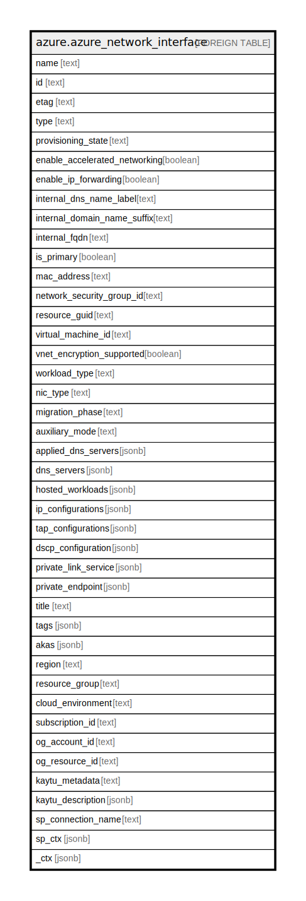

# azure.azure_network_interface

## Description

Azure Network Interface

## Columns

| Name | Type | Default | Nullable | Children | Parents | Comment |
| ---- | ---- | ------- | -------- | -------- | ------- | ------- |
| name | text |  | true |  |  | The friendly name that identifies the network interface |
| id | text |  | true |  |  | Contains ID to identify a network interface uniquely |
| etag | text |  | true |  |  | An unique read-only string that changes whenever the resource is updated |
| type | text |  | true |  |  | The resource type of the network interface |
| provisioning_state | text |  | true |  |  | Providsioning state of the network interface resource |
| enable_accelerated_networking | boolean |  | true |  |  | Indicates whether the network interface is accelerated networking enabled |
| enable_ip_forwarding | boolean |  | true |  |  | Indicates whether IP forwarding is enabled on this network interface |
| internal_dns_name_label | text |  | true |  |  | Relative DNS name for this NIC used for internal communications between VMs in the same virtual network |
| internal_domain_name_suffix | text |  | true |  |  | Contains domain name suffix for the network interface |
| internal_fqdn | text |  | true |  |  | Fully qualified DNS name supporting internal communications between VMs in the same virtual network |
| is_primary | boolean |  | true |  |  | Indicates whether this is a primary network interface on a virtual machine |
| mac_address | text |  | true |  |  | The MAC address of the network interface |
| network_security_group_id | text |  | true |  |  | The reference to the NetworkSecurityGroup resource |
| resource_guid | text |  | true |  |  | The resource GUID property of the network interface resource |
| virtual_machine_id | text |  | true |  |  | The reference to a virtual machine |
| vnet_encryption_supported | boolean |  | true |  |  | Whether the virtual machine this NIC is attached to supports encryption. |
| workload_type | text |  | true |  |  | Workload type of the network interface for BareMetal resources. |
| nic_type | text |  | true |  |  | Type of network interface resource (e.g., Standard, Elastic). |
| migration_phase | text |  | true |  |  | Migration phase of network interface resource. |
| auxiliary_mode | text |  | true |  |  | Auxiliary mode of network interface resource. |
| applied_dns_servers | jsonb |  | true |  |  | A list of applied dns servers |
| dns_servers | jsonb |  | true |  |  | A collection of DNS servers IP addresses |
| hosted_workloads | jsonb |  | true |  |  | A collection of references to linked BareMetal resources |
| ip_configurations | jsonb |  | true |  |  | A list of IPConfigurations of the network interface |
| tap_configurations | jsonb |  | true |  |  | A collection of TapConfigurations of the network interface |
| dscp_configuration | jsonb |  | true |  |  | A reference to the DSCP configuration to which the network interface is linked. |
| private_link_service | jsonb |  | true |  |  | Private link service of the network interface resource. |
| private_endpoint | jsonb |  | true |  |  | A reference to the private endpoint to which the network interface is linked. |
| title | text |  | true |  |  | Title of the resource. |
| tags | jsonb |  | true |  |  | A map of tags for the resource. |
| akas | jsonb |  | true |  |  | Array of globally unique identifier strings (also known as) for the resource. |
| region | text |  | true |  |  | The Azure region/location in which the resource is located. |
| resource_group | text |  | true |  |  | The resource group which holds this resource. |
| cloud_environment | text |  | true |  |  | The Azure Cloud Environment. |
| subscription_id | text |  | true |  |  | The Azure Subscription ID in which the resource is located. |
| og_account_id | text |  | true |  |  | The Platform Account ID in which the resource is located. |
| og_resource_id | text |  | true |  |  | The unique ID of the resource in opengovernance. |
| kaytu_metadata | text |  | true |  |  | Platform Metadata of the Azure resource. |
| kaytu_description | jsonb |  | true |  |  | The full model description of the resource |
| sp_connection_name | text |  | true |  |  | Steampipe connection name. |
| sp_ctx | jsonb |  | true |  |  | Steampipe context in JSON form. |
| _ctx | jsonb |  | true |  |  | Steampipe context in JSON form. |

## Relations

---

> Generated by [tbls](https://github.com/k1LoW/tbls)
