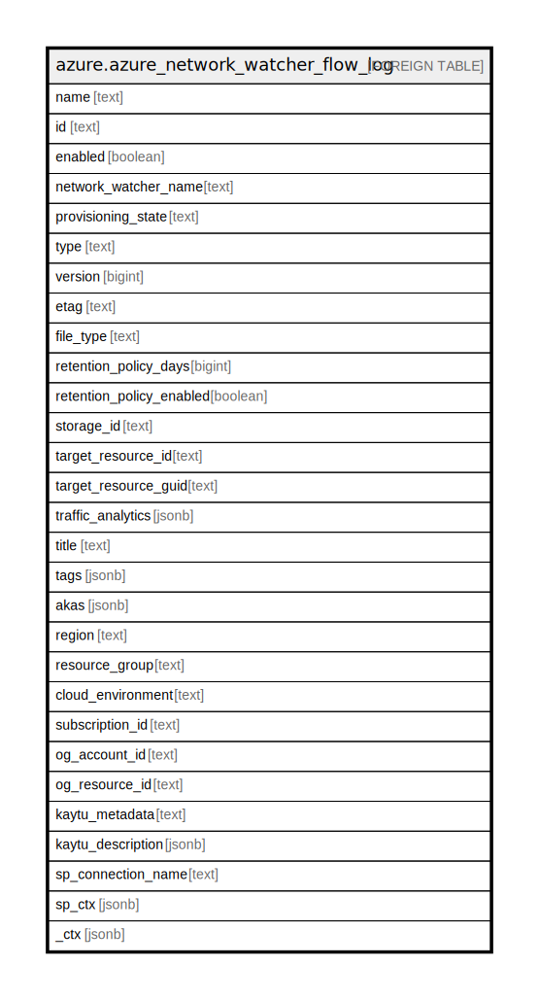

# azure.azure_network_watcher_flow_log

## Description

Azure Network Watcher FlowLog

## Columns

| Name | Type | Default | Nullable | Children | Parents | Comment |
| ---- | ---- | ------- | -------- | -------- | ------- | ------- |
| name | text |  | true |  |  | The friendly name that identifies the flow log. |
| id | text |  | true |  |  | Contains ID to identify a flow log uniquely. |
| enabled | boolean |  | true |  |  | Indicates whether the flow log is enabled, or not. |
| network_watcher_name | text |  | true |  |  | The friendly name that identifies the network watcher. |
| provisioning_state | text |  | true |  |  | The provisioning state of the flow log. |
| type | text |  | true |  |  | The resource type of the flow log. |
| version | bigint |  | true |  |  | The version (revision) of the flow log. |
| etag | text |  | true |  |  | An unique read-only string that changes whenever the resource is updated. |
| file_type | text |  | true |  |  | The file type of flow log. Possible values include: 'JSON'. |
| retention_policy_days | bigint |  | true |  |  | Specifies the number of days to retain flow log records. |
| retention_policy_enabled | boolean |  | true |  |  | Indicates whether flow log retention is enabled, or not. |
| storage_id | text |  | true |  |  | The ID of the storage account which is used to store the flow log. |
| target_resource_id | text |  | true |  |  | The ID of network security group to which flow log will be applied. |
| target_resource_guid | text |  | true |  |  | The Guid of network security group to which flow log will be applied. |
| traffic_analytics | jsonb |  | true |  |  | Defines the configuration of flow log traffic analytics. |
| title | text |  | true |  |  | Title of the resource. |
| tags | jsonb |  | true |  |  | A map of tags for the resource. |
| akas | jsonb |  | true |  |  | Array of globally unique identifier strings (also known as) for the resource. |
| region | text |  | true |  |  | The Azure region/location in which the resource is located. |
| resource_group | text |  | true |  |  | The resource group which holds this resource. |
| cloud_environment | text |  | true |  |  | The Azure Cloud Environment. |
| subscription_id | text |  | true |  |  | The Azure Subscription ID in which the resource is located. |
| og_account_id | text |  | true |  |  | The Platform Account ID in which the resource is located. |
| og_resource_id | text |  | true |  |  | The unique ID of the resource in opengovernance. |
| kaytu_metadata | text |  | true |  |  | Platform Metadata of the Azure resource. |
| kaytu_description | jsonb |  | true |  |  | The full model description of the resource |
| sp_connection_name | text |  | true |  |  | Steampipe connection name. |
| sp_ctx | jsonb |  | true |  |  | Steampipe context in JSON form. |
| _ctx | jsonb |  | true |  |  | Steampipe context in JSON form. |

## Relations

---

> Generated by [tbls](https://github.com/k1LoW/tbls)
