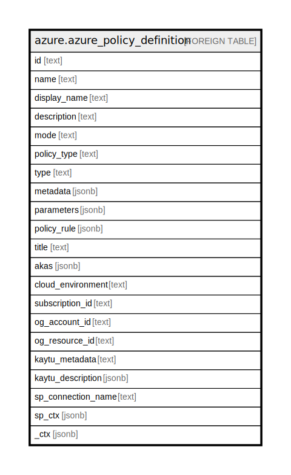

# azure.azure_policy_definition

## Description

Azure Policy Definition

## Columns

| Name | Type | Default | Nullable | Children | Parents | Comment |
| ---- | ---- | ------- | -------- | -------- | ------- | ------- |
| id | text |  | true |  |  | The ID of the policy definition. |
| name | text |  | true |  |  | The name of the policy definition. |
| display_name | text |  | true |  |  | The user-friendly display name of the policy definition. |
| description | text |  | true |  |  | The policy definition description. |
| mode | text |  | true |  |  | The policy definition mode. Some examples are All, Indexed, Microsoft.KeyVault.Data. |
| policy_type | text |  | true |  |  | The type of policy definition. Possible values are NotSpecified, BuiltIn, Custom, and Static. Possible values include: 'NotSpecified', 'BuiltIn', 'Custom', 'Static'. |
| type | text |  | true |  |  | The type of the resource (Microsoft.Authorization/policyDefinitions). |
| metadata | jsonb |  | true |  |  | The policy definition metadata.  Metadata is an open ended object and is typically a collection of key value pairs. |
| parameters | jsonb |  | true |  |  | The parameter definitions for parameters used in the policy rule. The keys are the parameter names. |
| policy_rule | jsonb |  | true |  |  | The policy rule. |
| title | text |  | true |  |  | Title of the resource. |
| akas | jsonb |  | true |  |  | Array of globally unique identifier strings (also known as) for the resource. |
| cloud_environment | text |  | true |  |  | The Azure Cloud Environment. |
| subscription_id | text |  | true |  |  | The Azure Subscription ID in which the resource is located. |
| og_account_id | text |  | true |  |  | The Platform Account ID in which the resource is located. |
| og_resource_id | text |  | true |  |  | The unique ID of the resource in opengovernance. |
| kaytu_metadata | text |  | true |  |  | Platform Metadata of the Azure resource. |
| kaytu_description | jsonb |  | true |  |  | The full model description of the resource |
| sp_connection_name | text |  | true |  |  | Steampipe connection name. |
| sp_ctx | jsonb |  | true |  |  | Steampipe context in JSON form. |
| _ctx | jsonb |  | true |  |  | Steampipe context in JSON form. |

## Relations

---

> Generated by [tbls](https://github.com/k1LoW/tbls)
