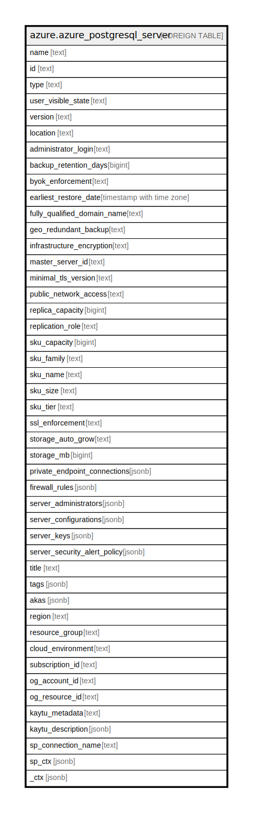

# azure.azure_postgresql_server

## Description

Azure PostgreSQL Server

## Columns

| Name | Type | Default | Nullable | Children | Parents | Comment |
| ---- | ---- | ------- | -------- | -------- | ------- | ------- |
| name | text |  | true |  |  | The friendly name that identifies the server. |
| id | text |  | true |  |  | Contains ID to identify a server uniquely. |
| type | text |  | true |  |  | The resource type of the SQL server. |
| user_visible_state | text |  | true |  |  | A state of a server that is visible to user. Possible values include: 'ServerStateReady', 'ServerStateDropping', 'ServerStateDisabled', 'ServerStateInaccessible'. |
| version | text |  | true |  |  | Specifies the version of the server. |
| location | text |  | true |  |  | The resource location. |
| administrator_login | text |  | true |  |  | Specifies the username of the administrator for this server. |
| backup_retention_days | bigint |  | true |  |  | Backup retention days for the server. |
| byok_enforcement | text |  | true |  |  | Status showing whether the server data encryption is enabled with customer-managed keys. |
| earliest_restore_date | timestamp with time zone |  | true |  |  | Specifies the earliest restore point creation time. |
| fully_qualified_domain_name | text |  | true |  |  | The fully qualified domain name of the server. |
| geo_redundant_backup | text |  | true |  |  | Indicates whether Geo-redundant is enabled, or not for server backup. |
| infrastructure_encryption | text |  | true |  |  | Status showing whether the server enabled infrastructure encryption. Possible values include: 'InfrastructureEncryptionEnabled', 'InfrastructureEncryptionDisabled'. |
| master_server_id | text |  | true |  |  | The master server id of a replica server. |
| minimal_tls_version | text |  | true |  |  | Enforce a minimal Tls version for the server. Possible values include: 'TLS10', 'TLS11', 'TLS12', 'TLSEnforcementDisabled'. |
| public_network_access | text |  | true |  |  | Indicates whether or not public network access is allowed for this server. Value is optional but if passed in, must be 'Enabled' or 'Disabled'. Possible values include: 'PublicNetworkAccessEnumEnabled', 'PublicNetworkAccessEnumDisabled'. |
| replica_capacity | bigint |  | true |  |  | The maximum number of replicas that a master server can have. |
| replication_role | text |  | true |  |  | The replication role of the server. |
| sku_capacity | bigint |  | true |  |  | The scale up/out capacity, representing server's compute units. |
| sku_family | text |  | true |  |  | The family of hardware. |
| sku_name | text |  | true |  |  | The name of the sku. For example: 'B_Gen4_1', 'GP_Gen5_8'. |
| sku_size | text |  | true |  |  | The size code, to be interpreted by resource as appropriate. |
| sku_tier | text |  | true |  |  | The tier of the particular SKU. Possible values include: 'Basic', 'GeneralPurpose', 'MemoryOptimized'. |
| ssl_enforcement | text |  | true |  |  | Enable ssl enforcement or not when connect to server. Possible values include: 'Enabled', 'Disabled'. |
| storage_auto_grow | text |  | true |  |  | Indicates whether storage auto grow is enabled, or not. |
| storage_mb | bigint |  | true |  |  | Indicates max storage allowed for a server. |
| private_endpoint_connections | jsonb |  | true |  |  | A list of private endpoint connections on a server. |
| firewall_rules | jsonb |  | true |  |  | A list of firewall rules for a server. |
| server_administrators | jsonb |  | true |  |  | A list of server administrators. |
| server_configurations | jsonb |  | true |  |  | A list of configurations for a server. |
| server_keys | jsonb |  | true |  |  | A list of server keys for a server. |
| server_security_alert_policy | jsonb |  | true |  |  | Server security alert policy associated with the PostgreSQL Server. |
| title | text |  | true |  |  | Title of the resource. |
| tags | jsonb |  | true |  |  | A map of tags for the resource. |
| akas | jsonb |  | true |  |  | Array of globally unique identifier strings (also known as) for the resource. |
| region | text |  | true |  |  | The Azure region/location in which the resource is located. |
| resource_group | text |  | true |  |  | The resource group which holds this resource. |
| cloud_environment | text |  | true |  |  | The Azure Cloud Environment. |
| subscription_id | text |  | true |  |  | The Azure Subscription ID in which the resource is located. |
| og_account_id | text |  | true |  |  | The Platform Account ID in which the resource is located. |
| og_resource_id | text |  | true |  |  | The unique ID of the resource in opengovernance. |
| kaytu_metadata | text |  | true |  |  | Platform Metadata of the Azure resource. |
| kaytu_description | jsonb |  | true |  |  | The full model description of the resource |
| sp_connection_name | text |  | true |  |  | Steampipe connection name. |
| sp_ctx | jsonb |  | true |  |  | Steampipe context in JSON form. |
| _ctx | jsonb |  | true |  |  | Steampipe context in JSON form. |

## Relations

---

> Generated by [tbls](https://github.com/k1LoW/tbls)
