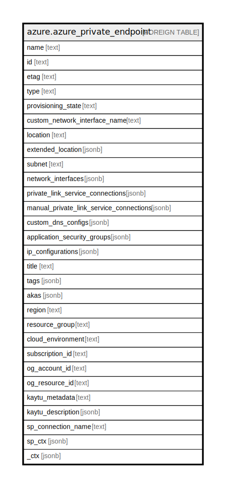

# azure.azure_private_endpoint

## Description

Azure Private Endpoint

## Columns

| Name | Type | Default | Nullable | Children | Parents | Comment |
| ---- | ---- | ------- | -------- | -------- | ------- | ------- |
| name | text |  | true |  |  | The name of the private endpoint. |
| id | text |  | true |  |  | The ID of the private endpoint. |
| etag | text |  | true |  |  | A unique read-only string that changes whenever the resource is updated. |
| type | text |  | true |  |  | The type of the private endpoint. |
| provisioning_state | text |  | true |  |  | The provisioning state of the private endpoint resource. |
| custom_network_interface_name | text |  | true |  |  | The custom name of the network interface attached to the private endpoint. |
| location | text |  | true |  |  | The location of the private endpoint. |
| extended_location | jsonb |  | true |  |  | The extended location of the private endpoint. |
| subnet | text |  | true |  |  | The ID of the subnet from which the private IP will be allocated. |
| network_interfaces | jsonb |  | true |  |  | An array of references to the network interfaces created for this private endpoint. |
| private_link_service_connections | jsonb |  | true |  |  | A grouping of information about the connection to the remote resource. |
| manual_private_link_service_connections | jsonb |  | true |  |  | A grouping of information about the connection to the remote resource. Used when the network admin does not have access to approve connections to the remote resource. |
| custom_dns_configs | jsonb |  | true |  |  | An array of custom DNS configurations. |
| application_security_groups | jsonb |  | true |  |  | Application security groups in which the private endpoint IP configuration is included. |
| ip_configurations | jsonb |  | true |  |  | A list of IP configurations of the private endpoint. |
| title | text |  | true |  |  | Title of the resource. |
| tags | jsonb |  | true |  |  | Tags associated with the resource. |
| akas | jsonb |  | true |  |  | Array of globally unique identifier strings (also known as) for the resource. |
| region | text |  | true |  |  | The Azure region where the resource is located. |
| resource_group | text |  | true |  |  | The resource group in which the resource is located. |
| cloud_environment | text |  | true |  |  | The Azure Cloud Environment. |
| subscription_id | text |  | true |  |  | The Azure Subscription ID in which the resource is located. |
| og_account_id | text |  | true |  |  | The Platform Account ID in which the resource is located. |
| og_resource_id | text |  | true |  |  | The unique ID of the resource in opengovernance. |
| kaytu_metadata | text |  | true |  |  | Platform Metadata of the Azure resource. |
| kaytu_description | jsonb |  | true |  |  | The full model description of the resource |
| sp_connection_name | text |  | true |  |  | Steampipe connection name. |
| sp_ctx | jsonb |  | true |  |  | Steampipe context in JSON form. |
| _ctx | jsonb |  | true |  |  | Steampipe context in JSON form. |

## Relations

---

> Generated by [tbls](https://github.com/k1LoW/tbls)
