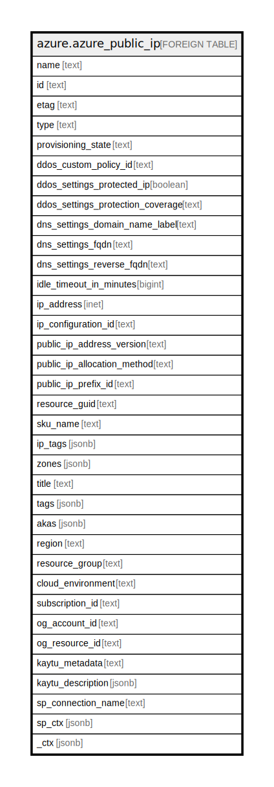

# azure.azure_public_ip

## Description

Azure Public IP

## Columns

| Name | Type | Default | Nullable | Children | Parents | Comment |
| ---- | ---- | ------- | -------- | -------- | ------- | ------- |
| name | text |  | true |  |  | The friendly name that identifies the public ip |
| id | text |  | true |  |  | Contains ID to identify a public ip uniquely |
| etag | text |  | true |  |  | An unique read-only string that changes whenever the resource is updated |
| type | text |  | true |  |  | The resource type of the public ip |
| provisioning_state | text |  | true |  |  | The resource type of the public ip |
| ddos_custom_policy_id | text |  | true |  |  | The DDoS custom policy associated with the public IP |
| ddos_settings_protected_ip | boolean |  | true |  |  | Indicates whether DDoS protection is enabled on the public IP, or not |
| ddos_settings_protection_coverage | text |  | true |  |  | The DDoS protection policy customizability of the public IP |
| dns_settings_domain_name_label | text |  | true |  |  | Contains the domain name label |
| dns_settings_fqdn | text |  | true |  |  | The Fully Qualified Domain Name of the A DNS record associated with the public IP |
| dns_settings_reverse_fqdn | text |  | true |  |  | Contains the reverse FQDN |
| idle_timeout_in_minutes | bigint |  | true |  |  | The idle timeout of the public IP address |
| ip_address | inet |  | true |  |  | The IP address associated with the public IP address resource |
| ip_configuration_id | text |  | true |  |  | Contains the IP configuration ID |
| public_ip_address_version | text |  | true |  |  | Contains the public IP address version |
| public_ip_allocation_method | text |  | true |  |  | Contains the public IP address allocation method |
| public_ip_prefix_id | text |  | true |  |  | The Public IP Prefix this Public IP Address should be allocated from |
| resource_guid | text |  | true |  |  | The resource GUID property of the public ip resource |
| sku_name | text |  | true |  |  | Name of a public IP address SKU |
| ip_tags | jsonb |  | true |  |  | A list of tags associated with the public IP address |
| zones | jsonb |  | true |  |  | A collection of availability zones denoting the IP allocated for the resource needs to come from |
| title | text |  | true |  |  | Title of the resource. |
| tags | jsonb |  | true |  |  | A map of tags for the resource. |
| akas | jsonb |  | true |  |  | Array of globally unique identifier strings (also known as) for the resource. |
| region | text |  | true |  |  | The Azure region/location in which the resource is located. |
| resource_group | text |  | true |  |  | The resource group which holds this resource. |
| cloud_environment | text |  | true |  |  | The Azure Cloud Environment. |
| subscription_id | text |  | true |  |  | The Azure Subscription ID in which the resource is located. |
| og_account_id | text |  | true |  |  | The Platform Account ID in which the resource is located. |
| og_resource_id | text |  | true |  |  | The unique ID of the resource in opengovernance. |
| kaytu_metadata | text |  | true |  |  | Platform Metadata of the Azure resource. |
| kaytu_description | jsonb |  | true |  |  | The full model description of the resource |
| sp_connection_name | text |  | true |  |  | Steampipe connection name. |
| sp_ctx | jsonb |  | true |  |  | Steampipe context in JSON form. |
| _ctx | jsonb |  | true |  |  | Steampipe context in JSON form. |

## Relations

---

> Generated by [tbls](https://github.com/k1LoW/tbls)
