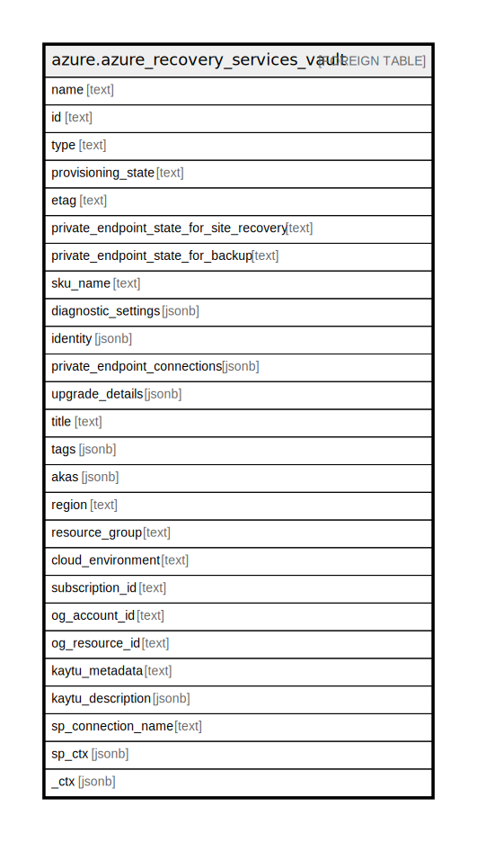

# azure.azure_recovery_services_vault

## Description

Azure Recovery Services Vault

## Columns

| Name | Type | Default | Nullable | Children | Parents | Comment |
| ---- | ---- | ------- | -------- | -------- | ------- | ------- |
| name | text |  | true |  |  | The resource name. |
| id | text |  | true |  |  | The resource identifier. |
| type | text |  | true |  |  | The resource type. |
| provisioning_state | text |  | true |  |  | The provisioning state of the recovery services vault. |
| etag | text |  | true |  |  | An unique read-only string that changes whenever the resource is updated. |
| private_endpoint_state_for_site_recovery | text |  | true |  |  | Private endpoint state for site recovery of the recovery services vault. |
| private_endpoint_state_for_backup | text |  | true |  |  | Private endpoint state for backup of the recovery services vault. |
| sku_name | text |  | true |  |  | The sku name of the recovery services vault. |
| diagnostic_settings | jsonb |  | true |  |  | A list of active diagnostic settings for the recovery services vault. |
| identity | jsonb |  | true |  |  | Managed service identity of the recovery services vault. |
| private_endpoint_connections | jsonb |  | true |  |  | List of private endpoint connections of the recovery services vault. |
| upgrade_details | jsonb |  | true |  |  | Upgrade details properties of the recovery services vault. |
| title | text |  | true |  |  | Title of the resource. |
| tags | jsonb |  | true |  |  | A map of tags for the resource. |
| akas | jsonb |  | true |  |  | Array of globally unique identifier strings (also known as) for the resource. |
| region | text |  | true |  |  | The Azure region/location in which the resource is located. |
| resource_group | text |  | true |  |  | The resource group which holds this resource. |
| cloud_environment | text |  | true |  |  | The Azure Cloud Environment. |
| subscription_id | text |  | true |  |  | The Azure Subscription ID in which the resource is located. |
| og_account_id | text |  | true |  |  | The Platform Account ID in which the resource is located. |
| og_resource_id | text |  | true |  |  | The unique ID of the resource in opengovernance. |
| kaytu_metadata | text |  | true |  |  | Platform Metadata of the Azure resource. |
| kaytu_description | jsonb |  | true |  |  | The full model description of the resource |
| sp_connection_name | text |  | true |  |  | Steampipe connection name. |
| sp_ctx | jsonb |  | true |  |  | Steampipe context in JSON form. |
| _ctx | jsonb |  | true |  |  | Steampipe context in JSON form. |

## Relations

---

> Generated by [tbls](https://github.com/k1LoW/tbls)
