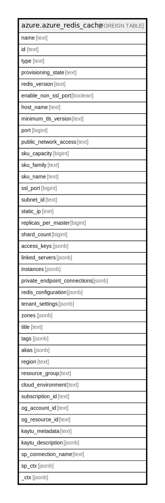

# azure.azure_redis_cache

## Description

Azure Redis Cache

## Columns

| Name | Type | Default | Nullable | Children | Parents | Comment |
| ---- | ---- | ------- | -------- | -------- | ------- | ------- |
| name | text |  | true |  |  | The name of the resource. |
| id | text |  | true |  |  | The unique id identifying the resource in subscription. |
| type | text |  | true |  |  | The type of the resource. |
| provisioning_state | text |  | true |  |  | The provisioning state of the redis instance at the time the operation was called. Valid values are: 'Creating', 'Deleting', 'Disabled', 'Failed', 'Linking', 'Provisioning', 'RecoveringScaleFailure', 'Scaling', 'Succeeded', 'Unlinking', 'Unprovisioning', and 'Updating'. |
| redis_version | text |  | true |  |  | Specifies the version. |
| enable_non_ssl_port | boolean |  | true |  |  | Specifies whether the non-ssl Redis server port (6379) is enabled. |
| host_name | text |  | true |  |  | Specifies the name of the redis host. |
| minimum_tls_version | text |  | true |  |  | Specifies the TLS version requires to connect. |
| port | bigint |  | true |  |  | Specifies the redis non-SSL port. |
| public_network_access | text |  | true |  |  | Indicates whether or not public endpoint access is allowed for this cache. Valid values are: 'Enabled', 'Disabled'. |
| sku_capacity | bigint |  | true |  |  | The size of the Redis cache to deploy. |
| sku_family | text |  | true |  |  | The SKU family to use. |
| sku_name | text |  | true |  |  | The type of Redis cache to deploy. |
| ssl_port | bigint |  | true |  |  | Specifies the redis SSL port. |
| subnet_id | text |  | true |  |  | The full resource ID of a subnet in a virtual network to deploy the Redis cache in. |
| static_ip | inet |  | true |  |  | Specifies the statis IP address. Required when deploying a Redis cache inside an existing Azure Virtual Network. |
| replicas_per_master | bigint |  | true |  |  | The number of replicas to be created per master. |
| shard_count | bigint |  | true |  |  | The number of shards to be created on a premium cluster cache. |
| access_keys | jsonb |  | true |  |  | The keys of the Redis cache. |
| linked_servers | jsonb |  | true |  |  | A list of the linked servers associated with the cache. |
| instances | jsonb |  | true |  |  | A list of the Redis instances associated with the cache. |
| private_endpoint_connections | jsonb |  | true |  |  | A list of private endpoint connection associated with the specified redis cache. |
| redis_configuration | jsonb |  | true |  |  | Describes the redis cache configuration. |
| tenant_settings | jsonb |  | true |  |  | A dictionary of tenant settings. |
| zones | jsonb |  | true |  |  | A list of availability zones denoting where the resource needs to come from. |
| title | text |  | true |  |  | Title of the resource. |
| tags | jsonb |  | true |  |  | A map of tags for the resource. |
| akas | jsonb |  | true |  |  | Array of globally unique identifier strings (also known as) for the resource. |
| region | text |  | true |  |  | The Azure region/location in which the resource is located. |
| resource_group | text |  | true |  |  | The resource group which holds this resource. |
| cloud_environment | text |  | true |  |  | The Azure Cloud Environment. |
| subscription_id | text |  | true |  |  | The Azure Subscription ID in which the resource is located. |
| og_account_id | text |  | true |  |  | The Platform Account ID in which the resource is located. |
| og_resource_id | text |  | true |  |  | The unique ID of the resource in opengovernance. |
| kaytu_metadata | text |  | true |  |  | Platform Metadata of the Azure resource. |
| kaytu_description | jsonb |  | true |  |  | The full model description of the resource |
| sp_connection_name | text |  | true |  |  | Steampipe connection name. |
| sp_ctx | jsonb |  | true |  |  | Steampipe context in JSON form. |
| _ctx | jsonb |  | true |  |  | Steampipe context in JSON form. |

## Relations

---

> Generated by [tbls](https://github.com/k1LoW/tbls)
