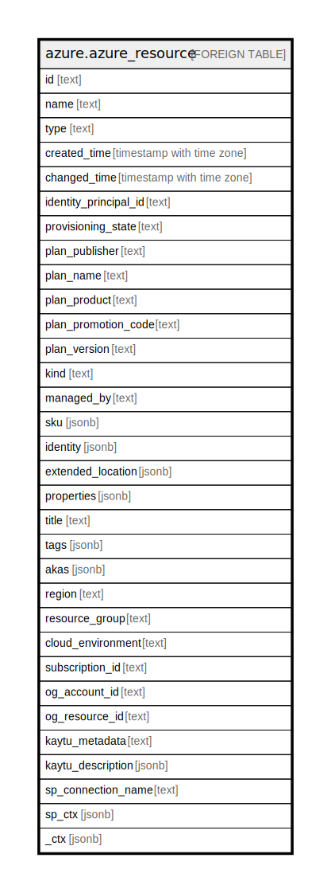

# azure.azure_resource

## Description

Azure Resource

## Columns

| Name | Type | Default | Nullable | Children | Parents | Comment |
| ---- | ---- | ------- | -------- | -------- | ------- | ------- |
| id | text |  | true |  |  | Resource ID. |
| name | text |  | true |  |  | Resource name. |
| type | text |  | true |  |  | Resource type. |
| created_time | timestamp with time zone |  | true |  |  | The created time of the resource. |
| changed_time | timestamp with time zone |  | true |  |  | The changed time of the resource. |
| identity_principal_id | text |  | true |  |  | The principal ID of resource identity. |
| provisioning_state | text |  | true |  |  | The provisioning state of the resource. |
| plan_publisher | text |  | true |  |  | The plan publisher ID. |
| plan_name | text |  | true |  |  | The plan ID. |
| plan_product | text |  | true |  |  | The plan offer ID. |
| plan_promotion_code | text |  | true |  |  | The plan promotion code. |
| plan_version | text |  | true |  |  | The plan's version. |
| kind | text |  | true |  |  | The kind of the resource. |
| managed_by | text |  | true |  |  | ID of the resource that manages this resource. |
| sku | jsonb |  | true |  |  | The SKU of the resource. |
| identity | jsonb |  | true |  |  | The identity of the resource. |
| extended_location | jsonb |  | true |  |  | Resource extended location. |
| properties | jsonb |  | true |  |  | The resource properties. |
| title | text |  | true |  |  | Title of the resource. |
| tags | jsonb |  | true |  |  | A map of tags for the resource. |
| akas | jsonb |  | true |  |  | Array of globally unique identifier strings (also known as) for the resource. |
| region | text |  | true |  |  | The Azure region/location in which the resource is located. |
| resource_group | text |  | true |  |  | The resource group which holds this resource. |
| cloud_environment | text |  | true |  |  | The Azure Cloud Environment. |
| subscription_id | text |  | true |  |  | The Azure Subscription ID in which the resource is located. |
| og_account_id | text |  | true |  |  | The Platform Account ID in which the resource is located. |
| og_resource_id | text |  | true |  |  | The unique ID of the resource in opengovernance. |
| kaytu_metadata | text |  | true |  |  | Platform Metadata of the Azure resource. |
| kaytu_description | jsonb |  | true |  |  | The full model description of the resource |
| sp_connection_name | text |  | true |  |  | Steampipe connection name. |
| sp_ctx | jsonb |  | true |  |  | Steampipe context in JSON form. |
| _ctx | jsonb |  | true |  |  | Steampipe context in JSON form. |

## Relations

---

> Generated by [tbls](https://github.com/k1LoW/tbls)
