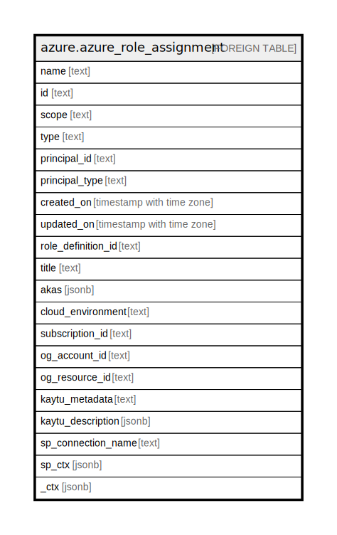

# azure.azure_role_assignment

## Description

Azure Role Assignment

## Columns

| Name | Type | Default | Nullable | Children | Parents | Comment |
| ---- | ---- | ------- | -------- | -------- | ------- | ------- |
| name | text |  | true |  |  | The friendly name that identifies the role assignment. |
| id | text |  | true |  |  | Contains ID to identify a role assignment uniquely. |
| scope | text |  | true |  |  | Current state of the role assignment. |
| type | text |  | true |  |  | Contains the resource type. |
| principal_id | text |  | true |  |  | Contains the principal id. |
| principal_type | text |  | true |  |  | Principal type of the assigned principal ID. |
| created_on | timestamp with time zone |  | true |  |  | Time it was created. |
| updated_on | timestamp with time zone |  | true |  |  | Time it was updated. |
| role_definition_id | text |  | true |  |  | Name of the assigned role definition. |
| title | text |  | true |  |  | Title of the resource. |
| akas | jsonb |  | true |  |  | Array of globally unique identifier strings (also known as) for the resource. |
| cloud_environment | text |  | true |  |  | The Azure Cloud Environment. |
| subscription_id | text |  | true |  |  | The Azure Subscription ID in which the resource is located. |
| og_account_id | text |  | true |  |  | The Platform Account ID in which the resource is located. |
| og_resource_id | text |  | true |  |  | The unique ID of the resource in opengovernance. |
| kaytu_metadata | text |  | true |  |  | Platform Metadata of the Azure resource. |
| kaytu_description | jsonb |  | true |  |  | The full model description of the resource |
| sp_connection_name | text |  | true |  |  | Steampipe connection name. |
| sp_ctx | jsonb |  | true |  |  | Steampipe context in JSON form. |
| _ctx | jsonb |  | true |  |  | Steampipe context in JSON form. |

## Relations

---

> Generated by [tbls](https://github.com/k1LoW/tbls)
