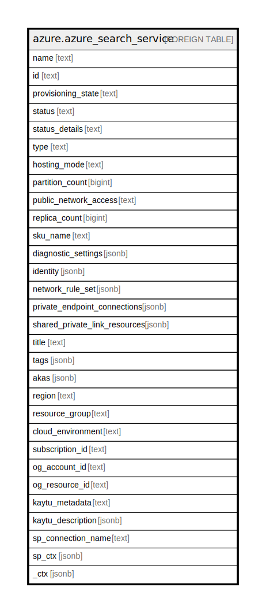

# azure.azure_search_service

## Description

Azure Search Service

## Columns

| Name | Type | Default | Nullable | Children | Parents | Comment |
| ---- | ---- | ------- | -------- | -------- | ------- | ------- |
| name | text |  | true |  |  | The name of the resource. |
| id | text |  | true |  |  | Fully qualified resource ID for the resource. |
| provisioning_state | text |  | true |  |  | The state of the last provisioning operation performed on the search service. |
| status | text |  | true |  |  | The status of the search service. Possible values include: 'running', deleting', 'provisioning', 'degraded', 'disabled', 'error' etc. |
| status_details | text |  | true |  |  | The details of the search service status. |
| type | text |  | true |  |  | The type of the resource. |
| hosting_mode | text |  | true |  |  | Applicable only for the standard3 SKU. You can set this property to enable up to 3 high density partitions that allow up to 1000 indexes, which is much higher than the maximum indexes allowed for any other SKU. For the standard3 SKU, the value is either 'default' or 'highDensity'. For all other SKUs, this value must be 'default'. Possible values include: 'Default', 'HighDensity'. |
| partition_count | bigint |  | true |  |  | The number of partitions in the search service; if specified, it can be 1, 2, 3, 4, 6, or 12. Values greater than 1 are only valid for standard SKUs. For 'standard3' services with hostingMode set to 'highDensity', the allowed values are between 1 and 3. |
| public_network_access | text |  | true |  |  | This value can be set to 'enabled' to avoid breaking changes on existing customer resources and templates. If set to 'disabled', traffic over public interface is not allowed, and private endpoint connections would be the exclusive access method. Possible values include: 'Enabled', 'Disabled'. |
| replica_count | bigint |  | true |  |  | The number of replicas in the search service. If specified, it must be a value between 1 and 12 inclusive for standard SKUs or between 1 and 3 inclusive for basic SKU. |
| sku_name | text |  | true |  |  | The SKU of the Search Service, which determines price tier and capacity limits. This property is required when creating a new search service. |
| diagnostic_settings | jsonb |  | true |  |  | A list of active diagnostic settings for the search service. |
| identity | jsonb |  | true |  |  | The identity of the resource. |
| network_rule_set | jsonb |  | true |  |  | Network specific rules that determine how the azure cognitive search service may be reached. |
| private_endpoint_connections | jsonb |  | true |  |  | The list of private endpoint connections to the azure cognitive search service. |
| shared_private_link_resources | jsonb |  | true |  |  | The list of shared private link resources managed by the azure cognitive search service. |
| title | text |  | true |  |  | Title of the resource. |
| tags | jsonb |  | true |  |  | A map of tags for the resource. |
| akas | jsonb |  | true |  |  | Array of globally unique identifier strings (also known as) for the resource. |
| region | text |  | true |  |  | The Azure region/location in which the resource is located. |
| resource_group | text |  | true |  |  | The resource group which holds this resource. |
| cloud_environment | text |  | true |  |  | The Azure Cloud Environment. |
| subscription_id | text |  | true |  |  | The Azure Subscription ID in which the resource is located. |
| og_account_id | text |  | true |  |  | The Platform Account ID in which the resource is located. |
| og_resource_id | text |  | true |  |  | The unique ID of the resource in opengovernance. |
| kaytu_metadata | text |  | true |  |  | Platform Metadata of the Azure resource. |
| kaytu_description | jsonb |  | true |  |  | The full model description of the resource |
| sp_connection_name | text |  | true |  |  | Steampipe connection name. |
| sp_ctx | jsonb |  | true |  |  | Steampipe context in JSON form. |
| _ctx | jsonb |  | true |  |  | Steampipe context in JSON form. |

## Relations

---

> Generated by [tbls](https://github.com/k1LoW/tbls)
