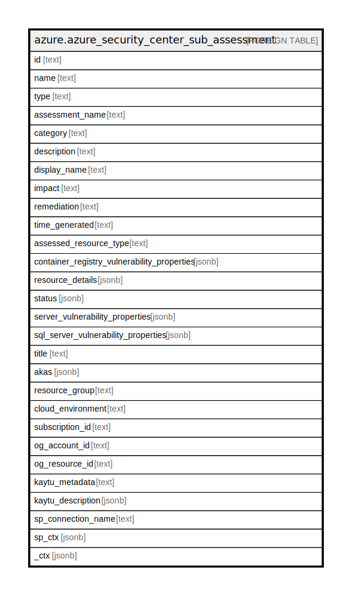

# azure.azure_security_center_sub_assessment

## Description

Azure Security Center Sub Assessment

## Columns

| Name | Type | Default | Nullable | Children | Parents | Comment |
| ---- | ---- | ------- | -------- | -------- | ------- | ------- |
| id | text |  | true |  |  | The resource id. |
| name | text |  | true |  |  | The resource name. |
| type | text |  | true |  |  | The resource type. |
| assessment_name | text |  | true |  |  | The assessment name. |
| category | text |  | true |  |  | Category of the sub-assessment. |
| description | text |  | true |  |  | Human readable description of the assessment status. |
| display_name | text |  | true |  |  | User friendly display name of the sub-assessment. |
| impact | text |  | true |  |  | Description of the impact of this sub-assessment. |
| remediation | text |  | true |  |  | Information on how to remediate this sub-assessment. |
| time_generated | text |  | true |  |  | The date and time the sub-assessment was generated. |
| assessed_resource_type | text |  | true |  |  | Details of the sub-assessment. |
| container_registry_vulnerability_properties | jsonb |  | true |  |  | ContainerRegistryVulnerabilityProperties details of the resource that was assessed. |
| resource_details | jsonb |  | true |  |  | Details of the resource that was assessed. |
| status | jsonb |  | true |  |  | The status of the sub-assessment. |
| server_vulnerability_properties | jsonb |  | true |  |  | ServerVulnerabilityProperties details of the resource that was assessed. |
| sql_server_vulnerability_properties | jsonb |  | true |  |  | SQLServerVulnerabilityProperties details of the resource that was assessed. |
| title | text |  | true |  |  | Title of the resource. |
| akas | jsonb |  | true |  |  | Array of globally unique identifier strings (also known as) for the resource. |
| resource_group | text |  | true |  |  | The resource group which holds this resource. |
| cloud_environment | text |  | true |  |  | The Azure Cloud Environment. |
| subscription_id | text |  | true |  |  | The Azure Subscription ID in which the resource is located. |
| og_account_id | text |  | true |  |  | The Platform Account ID in which the resource is located. |
| og_resource_id | text |  | true |  |  | The unique ID of the resource in opengovernance. |
| kaytu_metadata | text |  | true |  |  | Platform Metadata of the Azure resource. |
| kaytu_description | jsonb |  | true |  |  | The full model description of the resource |
| sp_connection_name | text |  | true |  |  | Steampipe connection name. |
| sp_ctx | jsonb |  | true |  |  | Steampipe context in JSON form. |
| _ctx | jsonb |  | true |  |  | Steampipe context in JSON form. |

## Relations

---

> Generated by [tbls](https://github.com/k1LoW/tbls)
