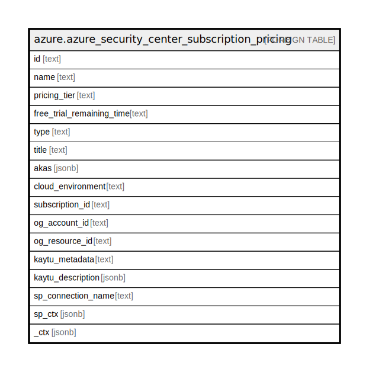

# azure.azure_security_center_subscription_pricing

## Description

Azure Security Center Subscription Pricing

## Columns

| Name | Type | Default | Nullable | Children | Parents | Comment |
| ---- | ---- | ------- | -------- | -------- | ------- | ------- |
| id | text |  | true |  |  | The pricing id. |
| name | text |  | true |  |  | Name of the pricing. |
| pricing_tier | text |  | true |  |  | The pricing tier value. Azure Security Center is provided in two pricing tiers: free and standard, with the standard tier available with a trial period. The standard tier offers advanced security capabilities, while the free tier offers basic security features. |
| free_trial_remaining_time | text |  | true |  |  | The duration left for the subscriptions free trial period. |
| type | text |  | true |  |  | Type of the pricing. |
| title | text |  | true |  |  | Title of the resource. |
| akas | jsonb |  | true |  |  | Array of globally unique identifier strings (also known as) for the resource. |
| cloud_environment | text |  | true |  |  | The Azure Cloud Environment. |
| subscription_id | text |  | true |  |  | The Azure Subscription ID in which the resource is located. |
| og_account_id | text |  | true |  |  | The Platform Account ID in which the resource is located. |
| og_resource_id | text |  | true |  |  | The unique ID of the resource in opengovernance. |
| kaytu_metadata | text |  | true |  |  | Platform Metadata of the Azure resource. |
| kaytu_description | jsonb |  | true |  |  | The full model description of the resource |
| sp_connection_name | text |  | true |  |  | Steampipe connection name. |
| sp_ctx | jsonb |  | true |  |  | Steampipe context in JSON form. |
| _ctx | jsonb |  | true |  |  | Steampipe context in JSON form. |

## Relations

---

> Generated by [tbls](https://github.com/k1LoW/tbls)
