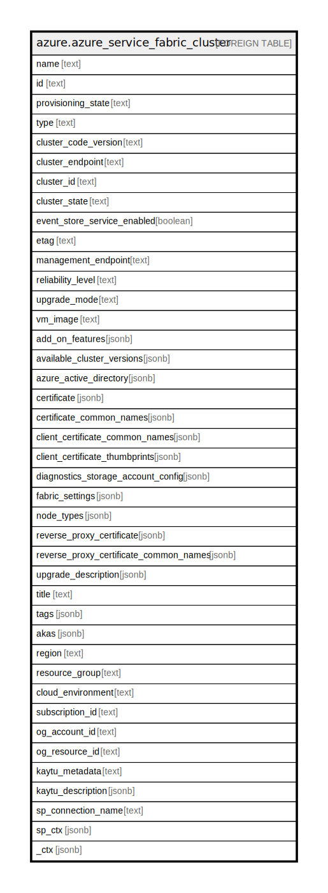

# azure.azure_service_fabric_cluster

## Description

Azure Service Fabric Cluster

## Columns

| Name | Type | Default | Nullable | Children | Parents | Comment |
| ---- | ---- | ------- | -------- | -------- | ------- | ------- |
| name | text |  | true |  |  | Azure resource name. |
| id | text |  | true |  |  | Azure resource identifier. |
| provisioning_state | text |  | true |  |  | The provisioning state of the cluster resource. Possible values include: 'Updating', 'Succeeded', 'Failed', 'Canceled'. |
| type | text |  | true |  |  | Azure resource type. |
| cluster_code_version | text |  | true |  |  | The service fabric runtime version of the cluster. This property can only by set the user when **upgradeMode** is set to 'Manual'. |
| cluster_endpoint | text |  | true |  |  | The azure resource provider endpoint. A system service in the cluster connects to this  endpoint. |
| cluster_id | text |  | true |  |  | A service generated unique identifier for the cluster resource. |
| cluster_state | text |  | true |  |  | The current state of the cluster. Possible values include: 'WaitingForNodes', 'Deploying', 'BaselineUpgrade', 'UpdatingUserConfiguration', 'UpdatingUserCertificate', 'UpdatingInfrastructure', 'EnforcingClusterVersion', 'UpgradeServiceUnreachable', 'AutoScale', 'Ready'. |
| event_store_service_enabled | boolean |  | true |  |  | Indicates if the event store service is enabled. |
| etag | text |  | true |  |  | Azure resource etag. |
| management_endpoint | text |  | true |  |  | The http management endpoint of the cluster. |
| reliability_level | text |  | true |  |  | The reliability level sets the replica set size of system services. Possible values include: 'None', 'Bronze', 'Silver', 'Gold', 'Platinum'. |
| upgrade_mode | text |  | true |  |  | The upgrade mode of the cluster when new service fabric runtime version is available. Possible values include: 'Automatic', 'Manual'. |
| vm_image | text |  | true |  |  | The VM image VMSS has been configured with. Generic names such as Windows or Linux can be used. |
| add_on_features | jsonb |  | true |  |  | The list of add-on features to enable in the cluster. |
| available_cluster_versions | jsonb |  | true |  |  | The service fabric runtime versions available for this cluster. |
| azure_active_directory | jsonb |  | true |  |  | The azure active directory authentication settings of the cluster. |
| certificate | jsonb |  | true |  |  | The certificate to use for securing the cluster. The certificate provided will be used for node to node security within the cluster, SSL certificate for cluster management endpoint and default admin client. |
| certificate_common_names | jsonb |  | true |  |  | Describes a list of server certificates referenced by common name that are used to secure the cluster. |
| client_certificate_common_names | jsonb |  | true |  |  | The list of client certificates referenced by common name that are allowed to manage the cluster. |
| client_certificate_thumbprints | jsonb |  | true |  |  | The list of client certificates referenced by thumbprint that are allowed to manage the cluster. |
| diagnostics_storage_account_config | jsonb |  | true |  |  | The storage account information for storing service fabric diagnostic logs. |
| fabric_settings | jsonb |  | true |  |  | The list of custom fabric settings to configure the cluster. |
| node_types | jsonb |  | true |  |  | The list of node types in the cluster. |
| reverse_proxy_certificate | jsonb |  | true |  |  | The server certificate used by reverse proxy. |
| reverse_proxy_certificate_common_names | jsonb |  | true |  |  | Describes a list of server certificates referenced by common name that are used to secure the cluster. |
| upgrade_description | jsonb |  | true |  |  | The policy to use when upgrading the cluster. |
| title | text |  | true |  |  | Title of the resource. |
| tags | jsonb |  | true |  |  | A map of tags for the resource. |
| akas | jsonb |  | true |  |  | Array of globally unique identifier strings (also known as) for the resource. |
| region | text |  | true |  |  | The Azure region/location in which the resource is located. |
| resource_group | text |  | true |  |  | The resource group which holds this resource. |
| cloud_environment | text |  | true |  |  | The Azure Cloud Environment. |
| subscription_id | text |  | true |  |  | The Azure Subscription ID in which the resource is located. |
| og_account_id | text |  | true |  |  | The Platform Account ID in which the resource is located. |
| og_resource_id | text |  | true |  |  | The unique ID of the resource in opengovernance. |
| kaytu_metadata | text |  | true |  |  | Platform Metadata of the Azure resource. |
| kaytu_description | jsonb |  | true |  |  | The full model description of the resource |
| sp_connection_name | text |  | true |  |  | Steampipe connection name. |
| sp_ctx | jsonb |  | true |  |  | Steampipe context in JSON form. |
| _ctx | jsonb |  | true |  |  | Steampipe context in JSON form. |

## Relations

---

> Generated by [tbls](https://github.com/k1LoW/tbls)
