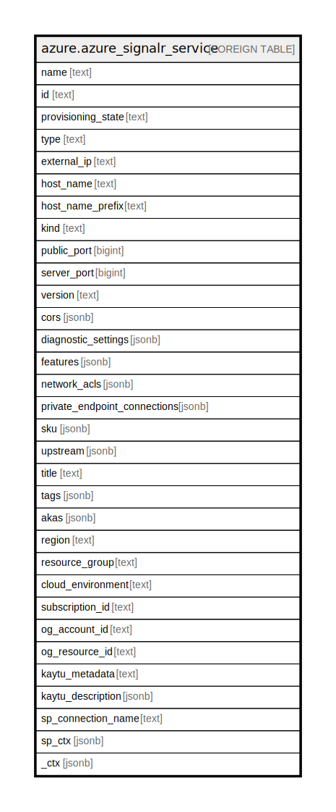

# azure.azure_signalr_service

## Description

Azure SignalR Service

## Columns

| Name | Type | Default | Nullable | Children | Parents | Comment |
| ---- | ---- | ------- | -------- | -------- | ------- | ------- |
| name | text |  | true |  |  | The name of the resource. |
| id | text |  | true |  |  | Fully qualified resource ID for the resource. |
| provisioning_state | text |  | true |  |  | Provisioning state of the resource. Possible values include: 'Unknown', 'Succeeded', 'Failed', 'Canceled', 'Running', 'Creating', 'Updating', 'Deleting', 'Moving'. |
| type | text |  | true |  |  | The type of the resource. |
| external_ip | text |  | true |  |  | The publicly accessible IP of the SignalR service. |
| host_name | text |  | true |  |  | FQDN of the SignalR service instance. |
| host_name_prefix | text |  | true |  |  | Prefix for the host name of the SignalR service. |
| kind | text |  | true |  |  | The kind of the service. Possible values include: 'SignalR', 'RawWebSockets'. |
| public_port | bigint |  | true |  |  | The publicly accessible port of the SignalR service which is designed for browser/client side usage. |
| server_port | bigint |  | true |  |  | The publicly accessible port of the SignalR service which is designed for customer server side usage. |
| version | text |  | true |  |  | Version of the SignalR resource. |
| cors | jsonb |  | true |  |  | Cross-Origin Resource Sharing (CORS) settings of the resource. |
| diagnostic_settings | jsonb |  | true |  |  | A list of active diagnostic settings for the SignalR service. |
| features | jsonb |  | true |  |  | List of SignalR feature flags. |
| network_acls | jsonb |  | true |  |  | Network ACLs of the resource. |
| private_endpoint_connections | jsonb |  | true |  |  | Private endpoint connections to the SignalR resource. |
| sku | jsonb |  | true |  |  | The billing information of the resource. |
| upstream | jsonb |  | true |  |  | Upstream settings when the Azure SignalR is in server-less mode. |
| title | text |  | true |  |  | Title of the resource. |
| tags | jsonb |  | true |  |  | A map of tags for the resource. |
| akas | jsonb |  | true |  |  | Array of globally unique identifier strings (also known as) for the resource. |
| region | text |  | true |  |  | The Azure region/location in which the resource is located. |
| resource_group | text |  | true |  |  | The resource group which holds this resource. |
| cloud_environment | text |  | true |  |  | The Azure Cloud Environment. |
| subscription_id | text |  | true |  |  | The Azure Subscription ID in which the resource is located. |
| og_account_id | text |  | true |  |  | The Platform Account ID in which the resource is located. |
| og_resource_id | text |  | true |  |  | The unique ID of the resource in opengovernance. |
| kaytu_metadata | text |  | true |  |  | Platform Metadata of the Azure resource. |
| kaytu_description | jsonb |  | true |  |  | The full model description of the resource |
| sp_connection_name | text |  | true |  |  | Steampipe connection name. |
| sp_ctx | jsonb |  | true |  |  | Steampipe context in JSON form. |
| _ctx | jsonb |  | true |  |  | Steampipe context in JSON form. |

## Relations

---

> Generated by [tbls](https://github.com/k1LoW/tbls)
