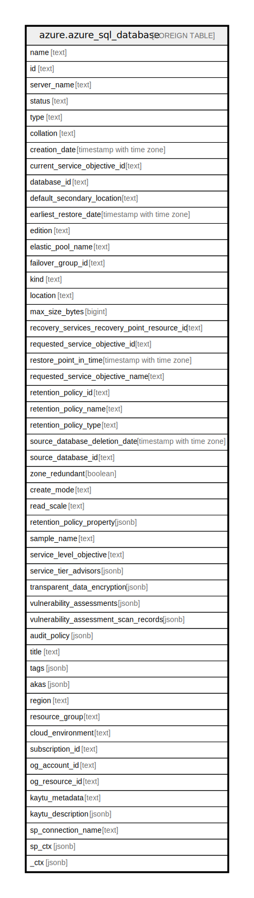

# azure.azure_sql_database

## Description

Azure SQL Database

## Columns

| Name | Type | Default | Nullable | Children | Parents | Comment |
| ---- | ---- | ------- | -------- | -------- | ------- | ------- |
| name | text |  | true |  |  | The friendly name that identifies the database. |
| id | text |  | true |  |  | Contains ID to identify a database uniquely. |
| server_name | text |  | true |  |  | The name of the parent server of the database. |
| status | text |  | true |  |  | The status of the database. |
| type | text |  | true |  |  | Type of the database. |
| collation | text |  | true |  |  | The collation of the database. |
| creation_date | timestamp with time zone |  | true |  |  | The creation date of the database. |
| current_service_objective_id | text |  | true |  |  | The current service level objective ID of the database. |
| database_id | text |  | true |  |  | The ID of the database. |
| default_secondary_location | text |  | true |  |  | The default secondary region for this database. |
| earliest_restore_date | timestamp with time zone |  | true |  |  | This records the earliest start date and time that restore is available for this database. |
| edition | text |  | true |  |  | The edition of the database. |
| elastic_pool_name | text |  | true |  |  | The name of the elastic pool the database is in. |
| failover_group_id | text |  | true |  |  | The resource identifier of the failover group containing this database. |
| kind | text |  | true |  |  | Kind of the database. |
| location | text |  | true |  |  | Location of the database. |
| max_size_bytes | bigint |  | true |  |  | The max size of the database expressed in bytes. |
| recovery_services_recovery_point_resource_id | text |  | true |  |  | Specifies the resource ID of the recovery point to restore from if createMode is RestoreLongTermRetentionBackup. |
| requested_service_objective_id | text |  | true |  |  | The configured service level objective ID of the database. |
| restore_point_in_time | timestamp with time zone |  | true |  |  | Specifies the point in time of the source database that will be restored to create the new database. |
| requested_service_objective_name | text |  | true |  |  | The name of the configured service level objective of the database. |
| retention_policy_id | text |  | true |  |  | Retention policy ID. |
| retention_policy_name | text |  | true |  |  | Retention policy Name. |
| retention_policy_type | text |  | true |  |  | Long term Retention policy Type. |
| source_database_deletion_date | timestamp with time zone |  | true |  |  | Specifies the time that the database was deleted when createMode is Restore and sourceDatabaseId is the deleted database's original resource id. |
| source_database_id | text |  | true |  |  | Specifies the resource ID of the source database if createMode is Copy, NonReadableSecondary, OnlineSecondary, PointInTimeRestore, Recovery, or Restore. |
| zone_redundant | boolean |  | true |  |  | Indicates if the database is zone redundant or not. |
| create_mode | text |  | true |  |  | Specifies the mode of database creation. |
| read_scale | text |  | true |  |  | ReadScale indicates whether read-only connections are allowed to this database or not if the database is a geo-secondary. |
| retention_policy_property | jsonb |  | true |  |  | Long term Retention policy Property. |
| sample_name | text |  | true |  |  | Indicates the name of the sample schema to apply when creating this database. |
| service_level_objective | text |  | true |  |  | The current service level objective of the database. |
| service_tier_advisors | jsonb |  | true |  |  | The list of service tier advisors for this database. |
| transparent_data_encryption | jsonb |  | true |  |  | The transparent data encryption info for this database. |
| vulnerability_assessments | jsonb |  | true |  |  | The vulnerability assessments for this database. |
| vulnerability_assessment_scan_records | jsonb |  | true |  |  | The vulnerability assessment scan records for this database. |
| audit_policy | jsonb |  | true |  |  | The database blob auditing policy. |
| title | text |  | true |  |  | Title of the resource. |
| tags | jsonb |  | true |  |  | A map of tags for the resource. |
| akas | jsonb |  | true |  |  | Array of globally unique identifier strings (also known as) for the resource. |
| region | text |  | true |  |  | The Azure region/location in which the resource is located. |
| resource_group | text |  | true |  |  | The resource group which holds this resource. |
| cloud_environment | text |  | true |  |  | The Azure Cloud Environment. |
| subscription_id | text |  | true |  |  | The Azure Subscription ID in which the resource is located. |
| og_account_id | text |  | true |  |  | The Platform Account ID in which the resource is located. |
| og_resource_id | text |  | true |  |  | The unique ID of the resource in opengovernance. |
| kaytu_metadata | text |  | true |  |  | Platform Metadata of the Azure resource. |
| kaytu_description | jsonb |  | true |  |  | The full model description of the resource |
| sp_connection_name | text |  | true |  |  | Steampipe connection name. |
| sp_ctx | jsonb |  | true |  |  | Steampipe context in JSON form. |
| _ctx | jsonb |  | true |  |  | Steampipe context in JSON form. |

## Relations

---

> Generated by [tbls](https://github.com/k1LoW/tbls)
