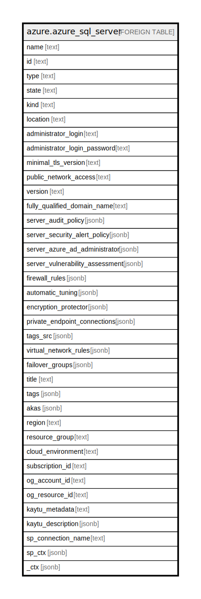

# azure.azure_sql_server

## Description

Azure SQL Server

## Columns

| Name | Type | Default | Nullable | Children | Parents | Comment |
| ---- | ---- | ------- | -------- | -------- | ------- | ------- |
| name | text |  | true |  |  | The friendly name that identifies the SQL server. |
| id | text |  | true |  |  | Contains ID to identify a SQL server uniquely. |
| type | text |  | true |  |  | The resource type of the SQL server. |
| state | text |  | true |  |  | The state of the server. |
| kind | text |  | true |  |  | The Kind of sql server. |
| location | text |  | true |  |  | The resource location. |
| administrator_login | text |  | true |  |  | Specifies the username of the administrator for this server. |
| administrator_login_password | text |  | true |  |  | The administrator login password. |
| minimal_tls_version | text |  | true |  |  | Minimal TLS version. Allowed values: '1.0', '1.1', '1.2'. |
| public_network_access | text |  | true |  |  | Whether or not public endpoint access is allowed for this server. |
| version | text |  | true |  |  | The version of the server. |
| fully_qualified_domain_name | text |  | true |  |  | The fully qualified domain name of the server. |
| server_audit_policy | jsonb |  | true |  |  | Specifies the audit policy configuration for server. |
| server_security_alert_policy | jsonb |  | true |  |  | Specifies the security alert policy configuration for server. |
| server_azure_ad_administrator | jsonb |  | true |  |  | Specifies the active directory administrator. |
| server_vulnerability_assessment | jsonb |  | true |  |  | Specifies the server's vulnerability assessment. |
| firewall_rules | jsonb |  | true |  |  | A list of firewall rules for this server. |
| automatic_tuning | jsonb |  | true |  |  | Automatic tuning setting for this server. |
| encryption_protector | jsonb |  | true |  |  | The server encryption protector. |
| private_endpoint_connections | jsonb |  | true |  |  | The private endpoint connections of the sql server. |
| tags_src | jsonb |  | true |  |  | Specifies the set of tags attached to the server. |
| virtual_network_rules | jsonb |  | true |  |  | A list of virtual network rules for this server. |
| failover_groups | jsonb |  | true |  |  | A list of failover groups for this server. |
| title | text |  | true |  |  | Title of the resource. |
| tags | jsonb |  | true |  |  | A map of tags for the resource. |
| akas | jsonb |  | true |  |  | Array of globally unique identifier strings (also known as) for the resource. |
| region | text |  | true |  |  | The Azure region/location in which the resource is located. |
| resource_group | text |  | true |  |  | The resource group which holds this resource. |
| cloud_environment | text |  | true |  |  | The Azure Cloud Environment. |
| subscription_id | text |  | true |  |  | The Azure Subscription ID in which the resource is located. |
| og_account_id | text |  | true |  |  | The Platform Account ID in which the resource is located. |
| og_resource_id | text |  | true |  |  | The unique ID of the resource in opengovernance. |
| kaytu_metadata | text |  | true |  |  | Platform Metadata of the Azure resource. |
| kaytu_description | jsonb |  | true |  |  | The full model description of the resource |
| sp_connection_name | text |  | true |  |  | Steampipe connection name. |
| sp_ctx | jsonb |  | true |  |  | Steampipe context in JSON form. |
| _ctx | jsonb |  | true |  |  | Steampipe context in JSON form. |

## Relations

---

> Generated by [tbls](https://github.com/k1LoW/tbls)
