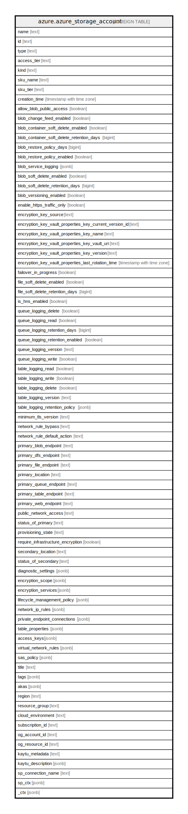

# azure.azure_storage_account

## Description

Azure Storage Account

## Columns

| Name | Type | Default | Nullable | Children | Parents | Comment |
| ---- | ---- | ------- | -------- | -------- | ------- | ------- |
| name | text |  | true |  |  | The friendly name that identifies the storage account. |
| id | text |  | true |  |  | Contains ID to identify a storage account uniquely. |
| type | text |  | true |  |  | Type of the resource. |
| access_tier | text |  | true |  |  | The access tier used for billing. |
| kind | text |  | true |  |  | The kind of the resource. |
| sku_name | text |  | true |  |  | Contains sku name of the storage account. |
| sku_tier | text |  | true |  |  | Contains sku tier of the storage account. |
| creation_time | timestamp with time zone |  | true |  |  | Creation date and time of the storage account. |
| allow_blob_public_access | boolean |  | true |  |  | Specifies whether allow or disallow public access to all blobs or containers in the storage account. |
| blob_change_feed_enabled | boolean |  | true |  |  | Specifies whether change feed event logging is enabled for the Blob service. |
| blob_container_soft_delete_enabled | boolean |  | true |  |  | Specifies whether DeleteRetentionPolicy is enabled. |
| blob_container_soft_delete_retention_days | bigint |  | true |  |  | Indicates the number of days that the deleted item should be retained. |
| blob_restore_policy_days | bigint |  | true |  |  | Specifies how long the blob can be restored. |
| blob_restore_policy_enabled | boolean |  | true |  |  | Specifies whether blob restore is enabled. |
| blob_service_logging | jsonb |  | true |  |  | Specifies the blob service properties for logging access. |
| blob_soft_delete_enabled | boolean |  | true |  |  | Specifies whether DeleteRetentionPolicy is enabled. |
| blob_soft_delete_retention_days | bigint |  | true |  |  | Indicates the number of days that the deleted item should be retained. |
| blob_versioning_enabled | boolean |  | true |  |  | Specifies whether versioning is enabled. |
| enable_https_traffic_only | boolean |  | true |  |  | Allows https traffic only to storage service if sets to true. |
| encryption_key_source | text |  | true |  |  | Contains the encryption keySource (provider). |
| encryption_key_vault_properties_key_current_version_id | text |  | true |  |  | The object identifier of the current versioned Key Vault Key in use. |
| encryption_key_vault_properties_key_name | text |  | true |  |  | The name of KeyVault key. |
| encryption_key_vault_properties_key_vault_uri | text |  | true |  |  | The Uri of KeyVault. |
| encryption_key_vault_properties_key_version | text |  | true |  |  | The version of KeyVault key. |
| encryption_key_vault_properties_last_rotation_time | timestamp with time zone |  | true |  |  | Timestamp of last rotation of the Key Vault Key. |
| failover_in_progress | boolean |  | true |  |  | Specifies whether the failover is in progress. |
| file_soft_delete_enabled | boolean |  | true |  |  | Specifies whether DeleteRetentionPolicy is enabled. |
| file_soft_delete_retention_days | bigint |  | true |  |  | Indicates the number of days that the deleted item should be retained. |
| is_hns_enabled | boolean |  | true |  |  | Specifies whether account HierarchicalNamespace is enabled. |
| queue_logging_delete | boolean |  | true |  |  | Specifies whether all delete requests should be logged. |
| queue_logging_read | boolean |  | true |  |  | Specifies whether all read requests should be logged. |
| queue_logging_retention_days | bigint |  | true |  |  | Indicates the number of days that metrics or logging data should be retained. |
| queue_logging_retention_enabled | boolean |  | true |  |  | Specifies whether a retention policy is enabled for the storage service. |
| queue_logging_version | text |  | true |  |  | The version of Storage Analytics to configure. |
| queue_logging_write | boolean |  | true |  |  | Specifies whether all write requests should be logged. |
| table_logging_read | boolean |  | true |  |  | Indicates whether all read requests should be logged. |
| table_logging_write | boolean |  | true |  |  | Indicates whether all write requests should be logged. |
| table_logging_delete | boolean |  | true |  |  | Indicates whether all delete requests should be logged. |
| table_logging_version | text |  | true |  |  | The version of Analytics to configure. |
| table_logging_retention_policy | jsonb |  | true |  |  | The retention policy. |
| minimum_tls_version | text |  | true |  |  | Contains the minimum TLS version to be permitted on requests to storage. |
| network_rule_bypass | text |  | true |  |  | Specifies whether traffic is bypassed for Logging/Metrics/AzureServices. |
| network_rule_default_action | text |  | true |  |  | Specifies the default action of allow or deny when no other rules match. |
| primary_blob_endpoint | text |  | true |  |  | Contains the blob endpoint. |
| primary_dfs_endpoint | text |  | true |  |  | Contains the dfs endpoint. |
| primary_file_endpoint | text |  | true |  |  | Contains the file endpoint. |
| primary_location | text |  | true |  |  | Contains the location of the primary data center for the storage account. |
| primary_queue_endpoint | text |  | true |  |  | Contains the queue endpoint. |
| primary_table_endpoint | text |  | true |  |  | Contains the table endpoint. |
| primary_web_endpoint | text |  | true |  |  | Contains the web endpoint. |
| public_network_access | text |  | true |  |  | Allow or disallow public network access to Storage Account. Value is optional but if passed in, must be Enabled or Disabled. |
| status_of_primary | text |  | true |  |  | The status indicating whether the primary location of the storage account is available or unavailable. Possible values include: 'available', 'unavailable'. |
| provisioning_state | text |  | true |  |  | The provisioning state of the storage account resource. |
| require_infrastructure_encryption | boolean |  | true |  |  | Specifies whether or not the service applies a secondary layer of encryption with platform managed keys for data at rest. |
| secondary_location | text |  | true |  |  | Contains the location of the geo-replicated secondary for the storage account. |
| status_of_secondary | text |  | true |  |  | The status indicating whether the secondary location of the storage account is available or unavailable. Only available if the SKU name is Standard_GRS or Standard_RAGRS. Possible values include: 'available', 'unavailable'. |
| diagnostic_settings | jsonb |  | true |  |  | A list of active diagnostic settings for the storage account. |
| encryption_scope | jsonb |  | true |  |  | Encryption scope details for the storage account. |
| encryption_services | jsonb |  | true |  |  | A list of services which support encryption. |
| lifecycle_management_policy | jsonb |  | true |  |  | The managementpolicy associated with the specified storage account. |
| network_ip_rules | jsonb |  | true |  |  | A list of IP ACL rules. |
| private_endpoint_connections | jsonb |  | true |  |  | A list of private endpoint connection associated with the specified storage account. |
| table_properties | jsonb |  | true |  |  | Azure Analytics Logging settings of tables. |
| access_keys | jsonb |  | true |  |  | The list of access keys or Kerberos keys (if active directory enabled) for the specified storage account. |
| virtual_network_rules | jsonb |  | true |  |  | A list of virtual network rules. |
| sas_policy | jsonb |  | true |  |  | A list of virtual network rules. |
| title | text |  | true |  |  | Title of the resource. |
| tags | jsonb |  | true |  |  | A map of tags for the resource. |
| akas | jsonb |  | true |  |  | Array of globally unique identifier strings (also known as) for the resource. |
| region | text |  | true |  |  | The Azure region/location in which the resource is located. |
| resource_group | text |  | true |  |  | The resource group which holds this resource. |
| cloud_environment | text |  | true |  |  | The Azure Cloud Environment. |
| subscription_id | text |  | true |  |  | The Azure Subscription ID in which the resource is located. |
| og_account_id | text |  | true |  |  | The Platform Account ID in which the resource is located. |
| og_resource_id | text |  | true |  |  | The unique ID of the resource in opengovernance. |
| kaytu_metadata | text |  | true |  |  | Platform Metadata of the Azure resource. |
| kaytu_description | jsonb |  | true |  |  | The full model description of the resource |
| sp_connection_name | text |  | true |  |  | Steampipe connection name. |
| sp_ctx | jsonb |  | true |  |  | Steampipe context in JSON form. |
| _ctx | jsonb |  | true |  |  | Steampipe context in JSON form. |

## Relations

---

> Generated by [tbls](https://github.com/k1LoW/tbls)
