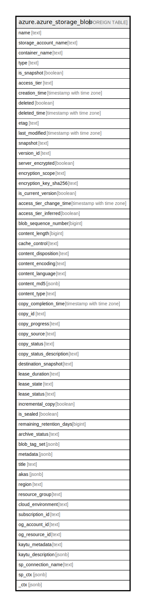

# azure.azure_storage_blob

## Description

Azure Storage Blob

## Columns

| Name | Type | Default | Nullable | Children | Parents | Comment |
| ---- | ---- | ------- | -------- | -------- | ------- | ------- |
| name | text |  | true |  |  | The friendly name that identifies the blob. |
| storage_account_name | text |  | true |  |  | The friendly name that identifies the storage account, in which the blob is located. |
| container_name | text |  | true |  |  | The friendly name that identifies the container, in which the blob has been uploaded. |
| type | text |  | true |  |  | Specifies the type of the blob. |
| is_snapshot | boolean |  | true |  |  | Specifies whether the resource is snapshot of a blob, or not. |
| access_tier | text |  | true |  |  | The tier of the blob. |
| creation_time | timestamp with time zone |  | true |  |  | Indicates the time, when the blob was uploaded. |
| deleted | boolean |  | true |  |  | Specifies whether the blob was deleted, or not. |
| deleted_time | timestamp with time zone |  | true |  |  | Specifies the deletion time of blob container. |
| etag | text |  | true |  |  | An unique read-only string that changes whenever the resource is updated. |
| last_modified | timestamp with time zone |  | true |  |  | Specifies the date and time the container was last modified. |
| snapshot | text |  | true |  |  | Specifies the time, when the snapshot is taken. |
| version_id | text |  | true |  |  | Specifies the version id. |
| server_encrypted | boolean |  | true |  |  | Indicates whether the blob is encrypted on the server, or not. |
| encryption_scope | text |  | true |  |  | The name of the encryption scope under which the blob is encrypted. |
| encryption_key_sha256 | text |  | true |  |  | The SHA-256 hash of the provided encryption key. |
| is_current_version | boolean |  | true |  |  | Specifies whether the blob container was deleted, or not. |
| access_tier_change_time | timestamp with time zone |  | true |  |  | Species the time, when the access tier has been updated. |
| access_tier_inferred | boolean |  | true |  |  | Indicates whether the access tier was inferred by the service. |
| blob_sequence_number | bigint |  | true |  |  | Specifies the sequence number for page blob used for coordinating concurrent writes. |
| content_length | bigint |  | true |  |  | Specifies the size of the content returned. |
| cache_control | text |  | true |  |  | Indicates the cache control specified for the blob. |
| content_disposition | text |  | true |  |  | Specifies additional information about how to process the response payload, and also can be used to attach additional metadata. |
| content_encoding | text |  | true |  |  | Indicates content encoding specified for the blob. |
| content_language | text |  | true |  |  | Indicates content language specified for the blob. |
| content_md5 | jsonb |  | true |  |  | If the content_md5 has been set for the blob, this response header is stored so that the client can check for message content integrity. |
| content_type | text |  | true |  |  | Specifies the content type specified for the blob. If no content type was specified, the default content type is application/octet-stream. |
| copy_completion_time | timestamp with time zone |  | true |  |  | Conclusion time of the last attempted Copy Blob operation where this blob was the destination blob. |
| copy_id | text |  | true |  |  | A String identifier for the last attempted Copy Blob operation where this blob was the destination blob. |
| copy_progress | text |  | true |  |  | Contains the number of bytes copied and the total bytes in the source in the last attempted Copy Blob operation where this blob was the destination blob. |
| copy_source | text |  | true |  |  | An URL up to 2 KB in length that specifies the source blob used in the last attempted Copy Blob operation where this blob was the destination blob. |
| copy_status | text |  | true |  |  | Specifies the state of the copy operation identified by Copy ID. |
| copy_status_description | text |  | true |  |  | Describes cause of fatal or non-fatal copy operation failure. |
| destination_snapshot | text |  | true |  |  | Included if the blob is incremental copy blob or incremental copy snapshot, if x-ms-copy-status is success. Snapshot time of the last successful incremental copy snapshot for this blob. |
| lease_duration | text |  | true |  |  | Specifies whether the lease is of infinite or fixed duration, when a blob is leased. |
| lease_state | text |  | true |  |  | Specifies lease state of the blob. |
| lease_status | text |  | true |  |  | Specifies the lease status of the blob. |
| incremental_copy | boolean |  | true |  |  | Copies the snapshot of the source page blob to a destination page blob. The snapshot is copied such that only the differential changes between the previously copied snapshot are transferred to the destination. |
| is_sealed | boolean |  | true |  |  | Indicate if the append blob is sealed or not. |
| remaining_retention_days | bigint |  | true |  |  | The number of days that the blob will be retained before being permanently deleted by the service. |
| archive_status | text |  | true |  |  | Specifies the archive status of the blob. |
| blob_tag_set | jsonb |  | true |  |  | A list of blob tags. |
| metadata | jsonb |  | true |  |  | A name-value pair to associate with the container as metadata. |
| title | text |  | true |  |  | Title of the resource. |
| akas | jsonb |  | true |  |  | Array of globally unique identifier strings (also known as) for the resource. |
| region | text |  | true |  |  | The Azure region/location in which the resource is located. |
| resource_group | text |  | true |  |  | The resource group which holds this resource. |
| cloud_environment | text |  | true |  |  | The Azure Cloud Environment. |
| subscription_id | text |  | true |  |  | The Azure Subscription ID in which the resource is located. |
| og_account_id | text |  | true |  |  | The Platform Account ID in which the resource is located. |
| og_resource_id | text |  | true |  |  | The unique ID of the resource in opengovernance. |
| kaytu_metadata | text |  | true |  |  | Platform Metadata of the Azure resource. |
| kaytu_description | jsonb |  | true |  |  | The full model description of the resource |
| sp_connection_name | text |  | true |  |  | Steampipe connection name. |
| sp_ctx | jsonb |  | true |  |  | Steampipe context in JSON form. |
| _ctx | jsonb |  | true |  |  | Steampipe context in JSON form. |

## Relations

---

> Generated by [tbls](https://github.com/k1LoW/tbls)
