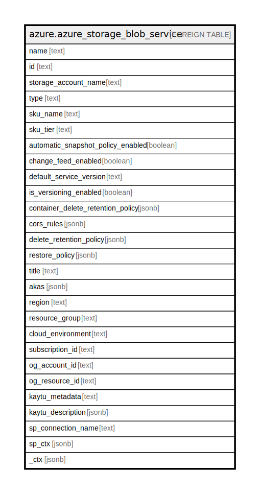

# azure.azure_storage_blob_service

## Description

Azure Storage Blob Service

## Columns

| Name | Type | Default | Nullable | Children | Parents | Comment |
| ---- | ---- | ------- | -------- | -------- | ------- | ------- |
| name | text |  | true |  |  | The friendly name that identifies the blob |
| id | text |  | true |  |  | Contains ID to identify a blob uniquely |
| storage_account_name | text |  | true |  |  | A unique read-only string that changes whenever the resource is updated |
| type | text |  | true |  |  | Type of the resource |
| sku_name | text |  | true |  |  | The sku name |
| sku_tier | text |  | true |  |  | Contains the sku tier |
| automatic_snapshot_policy_enabled | boolean |  | true |  |  | Specifies whether automatic snapshot creation is enabled, or not |
| change_feed_enabled | boolean |  | true |  |  | Specifies whether change feed event logging is enabled for the Blob service |
| default_service_version | text |  | true |  |  | Indicates the default version to use for requests to the Blob service if an incoming request’s version is not specified |
| is_versioning_enabled | boolean |  | true |  |  | Specifies whether the versioning is enabled, or not |
| container_delete_retention_policy | jsonb |  | true |  |  | The blob service properties for container soft delete |
| cors_rules | jsonb |  | true |  |  | A list of CORS rules for a storage account’s Blob service |
| delete_retention_policy | jsonb |  | true |  |  | The blob service properties for blob soft delete |
| restore_policy | jsonb |  | true |  |  | The blob service properties for blob restore policy |
| title | text |  | true |  |  | Title of the resource. |
| akas | jsonb |  | true |  |  | Array of globally unique identifier strings (also known as) for the resource. |
| region | text |  | true |  |  | The Azure region/location in which the resource is located. |
| resource_group | text |  | true |  |  | The resource group which holds this resource. |
| cloud_environment | text |  | true |  |  | The Azure Cloud Environment. |
| subscription_id | text |  | true |  |  | The Azure Subscription ID in which the resource is located. |
| og_account_id | text |  | true |  |  | The Platform Account ID in which the resource is located. |
| og_resource_id | text |  | true |  |  | The unique ID of the resource in opengovernance. |
| kaytu_metadata | text |  | true |  |  | Platform Metadata of the Azure resource. |
| kaytu_description | jsonb |  | true |  |  | The full model description of the resource |
| sp_connection_name | text |  | true |  |  | Steampipe connection name. |
| sp_ctx | jsonb |  | true |  |  | Steampipe context in JSON form. |
| _ctx | jsonb |  | true |  |  | Steampipe context in JSON form. |

## Relations

---

> Generated by [tbls](https://github.com/k1LoW/tbls)
