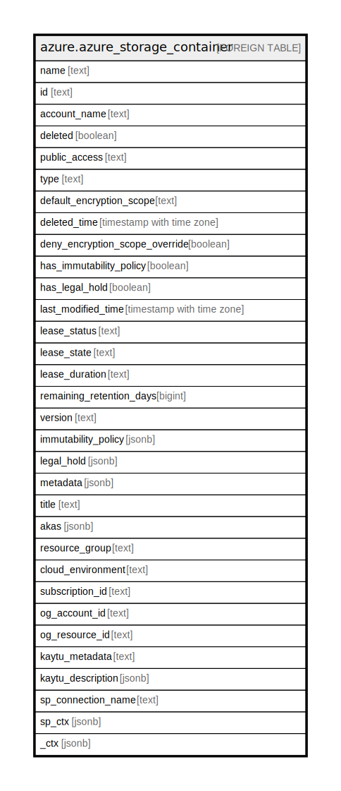

# azure.azure_storage_container

## Description

Azure Storage Container

## Columns

| Name | Type | Default | Nullable | Children | Parents | Comment |
| ---- | ---- | ------- | -------- | -------- | ------- | ------- |
| name | text |  | true |  |  | The friendly name that identifies the container. |
| id | text |  | true |  |  | Contains ID to identify a container uniquely. |
| account_name | text |  | true |  |  | The friendly name that identifies the storage account. |
| deleted | boolean |  | true |  |  | Indicates whether the blob container was deleted. |
| public_access | text |  | true |  |  | Specifies whether data in the container may be accessed publicly and the level of access. |
| type | text |  | true |  |  | Specifies the type of the container. |
| default_encryption_scope | text |  | true |  |  | Default the container to use specified encryption scope for all writes. |
| deleted_time | timestamp with time zone |  | true |  |  | Specifies the time when the container was deleted. |
| deny_encryption_scope_override | boolean |  | true |  |  | Indicates whether block override of encryption scope from the container default, or not. |
| has_immutability_policy | boolean |  | true |  |  | The hasImmutabilityPolicy public property is set to true by SRP if ImmutabilityPolicy has been created for this container. The hasImmutabilityPolicy public property is set to false by SRP if ImmutabilityPolicy has not been created for this container. |
| has_legal_hold | boolean |  | true |  |  | The hasLegalHold public property is set to true by SRP if there are at least one existing tag. The hasLegalHold public property is set to false by SRP if all existing legal hold tags are cleared out. There can be a maximum of 1000 blob containers with hasLegalHold=true for a given account. |
| last_modified_time | timestamp with time zone |  | true |  |  | Specifies the date and time the container was last modified. |
| lease_status | text |  | true |  |  | Specifies the lease status of the container. |
| lease_state | text |  | true |  |  | Specifies the lease state of the container. |
| lease_duration | text |  | true |  |  | Specifies whether the lease on a container is of infinite or fixed duration, only when the container is leased. Possible values are: 'Infinite', 'Fixed'. |
| remaining_retention_days | bigint |  | true |  |  | Remaining retention days for soft deleted blob container. |
| version | text |  | true |  |  | The version of the deleted blob container. |
| immutability_policy | jsonb |  | true |  |  | The ImmutabilityPolicy property of the container. |
| legal_hold | jsonb |  | true |  |  | The LegalHold property of the container. |
| metadata | jsonb |  | true |  |  | A name-value pair to associate with the container as metadata. |
| title | text |  | true |  |  | Title of the resource. |
| akas | jsonb |  | true |  |  | Array of globally unique identifier strings (also known as) for the resource. |
| resource_group | text |  | true |  |  | The resource group which holds this resource. |
| cloud_environment | text |  | true |  |  | The Azure Cloud Environment. |
| subscription_id | text |  | true |  |  | The Azure Subscription ID in which the resource is located. |
| og_account_id | text |  | true |  |  | The Platform Account ID in which the resource is located. |
| og_resource_id | text |  | true |  |  | The unique ID of the resource in opengovernance. |
| kaytu_metadata | text |  | true |  |  | Platform Metadata of the Azure resource. |
| kaytu_description | jsonb |  | true |  |  | The full model description of the resource |
| sp_connection_name | text |  | true |  |  | Steampipe connection name. |
| sp_ctx | jsonb |  | true |  |  | Steampipe context in JSON form. |
| _ctx | jsonb |  | true |  |  | Steampipe context in JSON form. |

## Relations

---

> Generated by [tbls](https://github.com/k1LoW/tbls)
