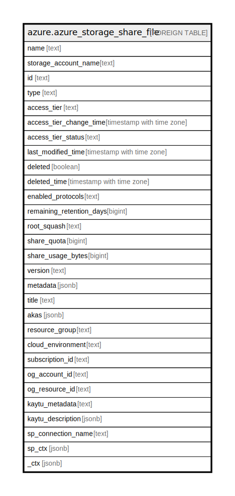

# azure.azure_storage_share_file

## Description

Azure Storage Share File

## Columns

| Name | Type | Default | Nullable | Children | Parents | Comment |
| ---- | ---- | ------- | -------- | -------- | ------- | ------- |
| name | text |  | true |  |  | The name of the resource. |
| storage_account_name | text |  | true |  |  | The name of the storage account. |
| id | text |  | true |  |  | Fully qualified resource ID for the resource. |
| type | text |  | true |  |  | The type of the resource. |
| access_tier | text |  | true |  |  | Access tier for specific share. GpV2 account can choose between TransactionOptimized (default), Hot, and Cool. |
| access_tier_change_time | timestamp with time zone |  | true |  |  | Indicates the last modification time for share access tier. |
| access_tier_status | text |  | true |  |  | Indicates if there is a pending transition for access tier. |
| last_modified_time | timestamp with time zone |  | true |  |  | Returns the date and time the share was last modified. |
| deleted | boolean |  | true |  |  | Indicates whether the share was deleted. |
| deleted_time | timestamp with time zone |  | true |  |  | The deleted time if the share was deleted. |
| enabled_protocols | text |  | true |  |  | The authentication protocol that is used for the file share. Can only be specified when creating a share. Possible values include: 'SMB', 'NFS'. |
| remaining_retention_days | bigint |  | true |  |  | Remaining retention days for share that was soft deleted. |
| root_squash | text |  | true |  |  | The property is for NFS share only. The default is NoRootSquash. Possible values include: 'NoRootSquash', 'RootSquash', 'AllSquash'. |
| share_quota | bigint |  | true |  |  | The maximum size of the share, in gigabytes. Must be greater than 0, and less than or equal to 5TB (5120). For Large File Shares, the maximum size is 102400. |
| share_usage_bytes | bigint |  | true |  |  | The approximate size of the data stored on the share. Note that this value may not include all recently created or recently resized files. |
| version | text |  | true |  |  | The version of the share. |
| metadata | jsonb |  | true |  |  | A name-value pair to associate with the share as metadata. |
| title | text |  | true |  |  | Title of the resource. |
| akas | jsonb |  | true |  |  | Array of globally unique identifier strings (also known as) for the resource. |
| resource_group | text |  | true |  |  | The resource group which holds this resource. |
| cloud_environment | text |  | true |  |  | The Azure Cloud Environment. |
| subscription_id | text |  | true |  |  | The Azure Subscription ID in which the resource is located. |
| og_account_id | text |  | true |  |  | The Platform Account ID in which the resource is located. |
| og_resource_id | text |  | true |  |  | The unique ID of the resource in opengovernance. |
| kaytu_metadata | text |  | true |  |  | Platform Metadata of the Azure resource. |
| kaytu_description | jsonb |  | true |  |  | The full model description of the resource |
| sp_connection_name | text |  | true |  |  | Steampipe connection name. |
| sp_ctx | jsonb |  | true |  |  | Steampipe context in JSON form. |
| _ctx | jsonb |  | true |  |  | Steampipe context in JSON form. |

## Relations

---

> Generated by [tbls](https://github.com/k1LoW/tbls)
