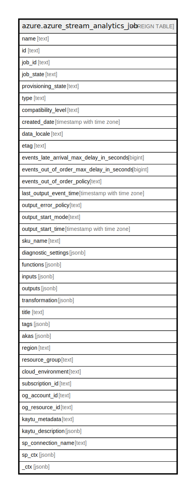

# azure.azure_stream_analytics_job

## Description

Azure Stream Analytics Job

## Columns

| Name | Type | Default | Nullable | Children | Parents | Comment |
| ---- | ---- | ------- | -------- | -------- | ------- | ------- |
| name | text |  | true |  |  | The resource name. |
| id | text |  | true |  |  | The resource identifier. |
| job_id | text |  | true |  |  | A GUID uniquely identifying the streaming job. |
| job_state | text |  | true |  |  | Describes the state of the streaming job. |
| provisioning_state | text |  | true |  |  | Describes the provisioning status of the streaming job. |
| type | text |  | true |  |  | The resource type. |
| compatibility_level | text |  | true |  |  | Controls certain runtime behaviors of the streaming job. |
| created_date | timestamp with time zone |  | true |  |  | Specifies the time when the stream analytics job was created. |
| data_locale | text |  | true |  |  | The data locale of the stream analytics job. |
| etag | text |  | true |  |  | An unique read-only string that changes whenever the resource is updated. |
| events_late_arrival_max_delay_in_seconds | bigint |  | true |  |  | The maximum tolerable delay in seconds where events arriving late could be included. |
| events_out_of_order_max_delay_in_seconds | bigint |  | true |  |  | The maximum tolerable delay in seconds where out-of-order events can be adjusted to be back in order. |
| events_out_of_order_policy | text |  | true |  |  | Indicates the policy to apply to events that arrive out of order in the input event stream. |
| last_output_event_time | timestamp with time zone |  | true |  |  | Indicating the last output event time of the streaming job or null indicating that output has not yet been produced. |
| output_error_policy | text |  | true |  |  | Indicates the policy to apply to events that arrive at the output and cannot be written to the external storage due to being malformed (missing column values, column values of wrong type or size). |
| output_start_mode | text |  | true |  |  | This property should only be utilized when it is desired that the job be started immediately upon creation. |
| output_start_time | timestamp with time zone |  | true |  |  | Indicates the starting point of the output event stream, or null to indicate that the output event stream will start whenever the streaming job is started. |
| sku_name | text |  | true |  |  | Describes the sku name of the streaming job. |
| diagnostic_settings | jsonb |  | true |  |  | A list of active diagnostic settings for the streaming job. |
| functions | jsonb |  | true |  |  | A list of one or more functions for the streaming job. |
| inputs | jsonb |  | true |  |  | A list of one or more inputs to the streaming job. |
| outputs | jsonb |  | true |  |  | A list of one or more outputs for the streaming job. |
| transformation | jsonb |  | true |  |  | Indicates the query and the number of streaming units to use for the streaming job. |
| title | text |  | true |  |  | Title of the resource. |
| tags | jsonb |  | true |  |  | A map of tags for the resource. |
| akas | jsonb |  | true |  |  | Array of globally unique identifier strings (also known as) for the resource. |
| region | text |  | true |  |  | The Azure region/location in which the resource is located. |
| resource_group | text |  | true |  |  | The resource group which holds this resource. |
| cloud_environment | text |  | true |  |  | The Azure Cloud Environment. |
| subscription_id | text |  | true |  |  | The Azure Subscription ID in which the resource is located. |
| og_account_id | text |  | true |  |  | The Platform Account ID in which the resource is located. |
| og_resource_id | text |  | true |  |  | The unique ID of the resource in opengovernance. |
| kaytu_metadata | text |  | true |  |  | Platform Metadata of the Azure resource. |
| kaytu_description | jsonb |  | true |  |  | The full model description of the resource |
| sp_connection_name | text |  | true |  |  | Steampipe connection name. |
| sp_ctx | jsonb |  | true |  |  | Steampipe context in JSON form. |
| _ctx | jsonb |  | true |  |  | Steampipe context in JSON form. |

## Relations

---

> Generated by [tbls](https://github.com/k1LoW/tbls)
