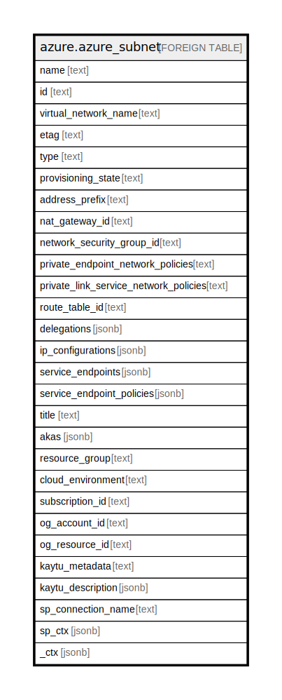

# azure.azure_subnet

## Description

Azure Subnet

## Columns

| Name | Type | Default | Nullable | Children | Parents | Comment |
| ---- | ---- | ------- | -------- | -------- | ------- | ------- |
| name | text |  | true |  |  | The friendly name that identifies the subnet. |
| id | text |  | true |  |  | Contains ID to identify a subnet uniquely. |
| virtual_network_name | text |  | true |  |  | The friendly name of the virtual network in which the subnet is created. |
| etag | text |  | true |  |  | An unique read-only string that changes whenever the resource is updated. |
| type | text |  | true |  |  | Type of the resource. |
| provisioning_state | text |  | true |  |  | The provisioning state of the subnet resource. |
| address_prefix | text |  | true |  |  | Contains the address prefix for the subnet. |
| nat_gateway_id | text |  | true |  |  | The ID of the Nat gateway associated with the subnet. |
| network_security_group_id | text |  | true |  |  | Network security group associated with the subnet. |
| private_endpoint_network_policies | text |  | true |  |  | Enable or Disable apply network policies on private end point in the subnet. |
| private_link_service_network_policies | text |  | true |  |  | Enable or Disable apply network policies on private link service in the subnet. |
| route_table_id | text |  | true |  |  | Route table associated with the subnet. |
| delegations | jsonb |  | true |  |  | A list of references to the delegations on the subnet. |
| ip_configurations | jsonb |  | true |  |  | IP Configuration details in a subnet. |
| service_endpoints | jsonb |  | true |  |  | A list of service endpoints. |
| service_endpoint_policies | jsonb |  | true |  |  | A list of service endpoint policies. |
| title | text |  | true |  |  | Title of the resource. |
| akas | jsonb |  | true |  |  | Array of globally unique identifier strings (also known as) for the resource. |
| resource_group | text |  | true |  |  | The resource group which holds this resource. |
| cloud_environment | text |  | true |  |  | The Azure Cloud Environment. |
| subscription_id | text |  | true |  |  | The Azure Subscription ID in which the resource is located. |
| og_account_id | text |  | true |  |  | The Platform Account ID in which the resource is located. |
| og_resource_id | text |  | true |  |  | The unique ID of the resource in opengovernance. |
| kaytu_metadata | text |  | true |  |  | Platform Metadata of the Azure resource. |
| kaytu_description | jsonb |  | true |  |  | The full model description of the resource |
| sp_connection_name | text |  | true |  |  | Steampipe connection name. |
| sp_ctx | jsonb |  | true |  |  | Steampipe context in JSON form. |
| _ctx | jsonb |  | true |  |  | Steampipe context in JSON form. |

## Relations

---

> Generated by [tbls](https://github.com/k1LoW/tbls)
