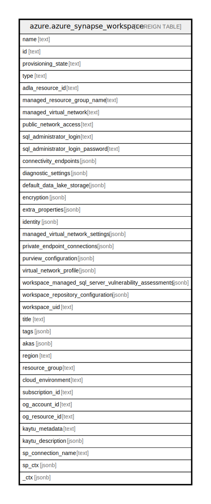

# azure.azure_synapse_workspace

## Description

Azure Synapse Workspace

## Columns

| Name | Type | Default | Nullable | Children | Parents | Comment |
| ---- | ---- | ------- | -------- | -------- | ------- | ------- |
| name | text |  | true |  |  | The name of the resource. |
| id | text |  | true |  |  | Fully qualified resource ID for the resource. |
| provisioning_state | text |  | true |  |  | The provisioning state of the resource. |
| type | text |  | true |  |  | The type of the resource. |
| adla_resource_id | text |  | true |  |  | The ADLA resource ID. |
| managed_resource_group_name | text |  | true |  |  | The managed resource group of the resource. |
| managed_virtual_network | text |  | true |  |  | A managed virtual network for the workspace. |
| public_network_access | text |  | true |  |  | Pubic network access to workspace. |
| sql_administrator_login | text |  | true |  |  | Login for workspace SQL active directory administrator. |
| sql_administrator_login_password | text |  | true |  |  | The SQL administrator login password of the resource. |
| connectivity_endpoints | jsonb |  | true |  |  | Connectivity endpoints of the resource. |
| diagnostic_settings | jsonb |  | true |  |  | A list of active diagnostic settings for the resource. |
| default_data_lake_storage | jsonb |  | true |  |  | Workspace default data lake storage account details. |
| encryption | jsonb |  | true |  |  | The encryption details of the workspace. |
| extra_properties | jsonb |  | true |  |  | Workspace level configs and feature flags. |
| identity | jsonb |  | true |  |  | The identity of the workspace. |
| managed_virtual_network_settings | jsonb |  | true |  |  | Managed virtual network settings of the workspace. |
| private_endpoint_connections | jsonb |  | true |  |  | Private endpoint connections to the workspace. |
| purview_configuration | jsonb |  | true |  |  | Purview configuration of the workspace. |
| virtual_network_profile | jsonb |  | true |  |  | Virtual network profile of the resource. |
| workspace_managed_sql_server_vulnerability_assessments | jsonb |  | true |  |  | The vulnerability assessments details of the workspace. |
| workspace_repository_configuration | jsonb |  | true |  |  | Git integration settings of the workspace. |
| workspace_uid | text |  | true |  |  | The unique identifier of the workspace. |
| title | text |  | true |  |  | Title of the resource. |
| tags | jsonb |  | true |  |  | A map of tags for the resource. |
| akas | jsonb |  | true |  |  | Array of globally unique identifier strings (also known as) for the resource. |
| region | text |  | true |  |  | The Azure region/location in which the resource is located. |
| resource_group | text |  | true |  |  | The resource group which holds this resource. |
| cloud_environment | text |  | true |  |  | The Azure Cloud Environment. |
| subscription_id | text |  | true |  |  | The Azure Subscription ID in which the resource is located. |
| og_account_id | text |  | true |  |  | The Platform Account ID in which the resource is located. |
| og_resource_id | text |  | true |  |  | The unique ID of the resource in opengovernance. |
| kaytu_metadata | text |  | true |  |  | Platform Metadata of the Azure resource. |
| kaytu_description | jsonb |  | true |  |  | The full model description of the resource |
| sp_connection_name | text |  | true |  |  | Steampipe connection name. |
| sp_ctx | jsonb |  | true |  |  | Steampipe context in JSON form. |
| _ctx | jsonb |  | true |  |  | Steampipe context in JSON form. |

## Relations

---

> Generated by [tbls](https://github.com/k1LoW/tbls)
