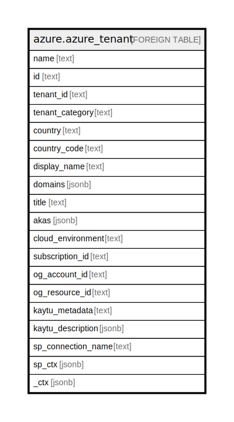

# azure.azure_tenant

## Description

Azure Tenant

## Columns

| Name | Type | Default | Nullable | Children | Parents | Comment |
| ---- | ---- | ------- | -------- | -------- | ------- | ------- |
| name | text |  | true |  |  | The display name of the tenant. |
| id | text |  | true |  |  | The fully qualified ID of the tenant. For example, /tenants/00000000-0000-0000-0000-000000000000. |
| tenant_id | text |  | true |  |  | The tenant ID. For example, 00000000-0000-0000-0000-000000000000. |
| tenant_category | text |  | true |  |  | The tenant category. Possible values include: 'Home', 'ProjectedBy', 'ManagedBy'. |
| country | text |  | true |  |  | Country/region name of the address for the tenant. |
| country_code | text |  | true |  |  | Country/region abbreviation for the tenant. |
| display_name | text |  | true |  |  | The list of domains for the tenant. |
| domains | jsonb |  | true |  |  | The list of domains for the tenant. |
| title | text |  | true |  |  | Title of the resource. |
| akas | jsonb |  | true |  |  | Array of globally unique identifier strings (also known as) for the resource. |
| cloud_environment | text |  | true |  |  | The Azure Cloud Environment. |
| subscription_id | text |  | true |  |  | The Azure Subscription ID in which the resource is located. |
| og_account_id | text |  | true |  |  | The Platform Account ID in which the resource is located. |
| og_resource_id | text |  | true |  |  | The unique ID of the resource in opengovernance. |
| kaytu_metadata | text |  | true |  |  | Platform Metadata of the Azure resource. |
| kaytu_description | jsonb |  | true |  |  | The full model description of the resource |
| sp_connection_name | text |  | true |  |  | Steampipe connection name. |
| sp_ctx | jsonb |  | true |  |  | Steampipe context in JSON form. |
| _ctx | jsonb |  | true |  |  | Steampipe context in JSON form. |

## Relations

---

> Generated by [tbls](https://github.com/k1LoW/tbls)
