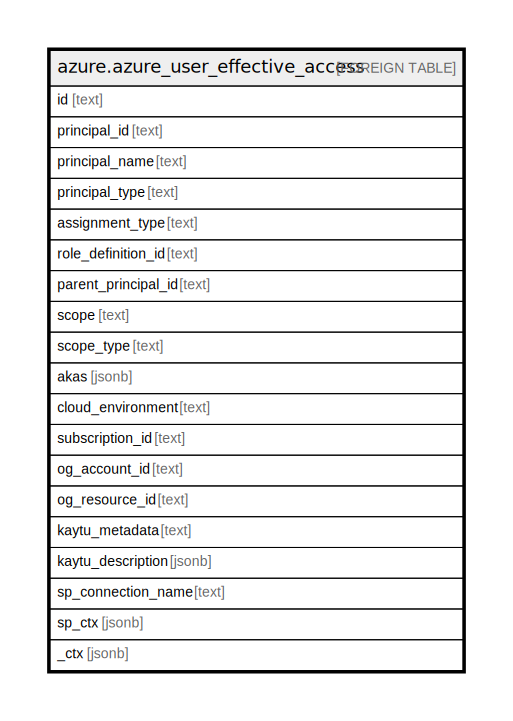

# azure.azure_user_effective_access

## Description

Azure User Effective Access

## Columns

| Name | Type | Default | Nullable | Children | Parents | Comment |
| ---- | ---- | ------- | -------- | -------- | ------- | ------- |
| id | text |  | true |  |  | Contains ID to identify a role assignment uniquely. |
| principal_id | text |  | true |  |  | User ID |
| principal_name | text |  | true |  |  | The friendly name that identifies the role assignment. |
| principal_type | text |  | true |  |  | Contains the resource type. |
| assignment_type | text |  | true |  |  | Assignment type (Explicit, GroupAssignment) |
| role_definition_id | text |  | true |  |  | Name of the assigned role definition. |
| parent_principal_id | text |  | true |  |  | Parent group principal id |
| scope | text |  | true |  |  | Role scope |
| scope_type | text |  | true |  |  | Role scope type |
| akas | jsonb |  | true |  |  | Array of globally unique identifier strings (also known as) for the resource. |
| cloud_environment | text |  | true |  |  | The Azure Cloud Environment. |
| subscription_id | text |  | true |  |  | The Azure Subscription ID in which the resource is located. |
| og_account_id | text |  | true |  |  | The Platform Account ID in which the resource is located. |
| og_resource_id | text |  | true |  |  | The unique ID of the resource in opengovernance. |
| kaytu_metadata | text |  | true |  |  | Platform Metadata of the Azure resource. |
| kaytu_description | jsonb |  | true |  |  | The full model description of the resource |
| sp_connection_name | text |  | true |  |  | Steampipe connection name. |
| sp_ctx | jsonb |  | true |  |  | Steampipe context in JSON form. |
| _ctx | jsonb |  | true |  |  | Steampipe context in JSON form. |

## Relations

---

> Generated by [tbls](https://github.com/k1LoW/tbls)
