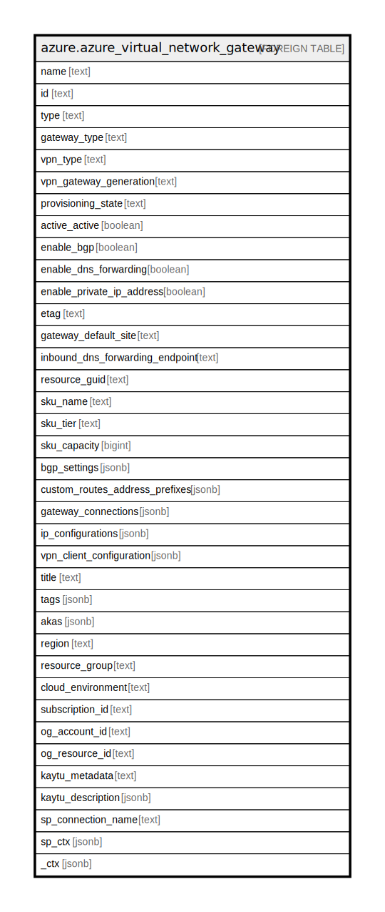

# azure.azure_virtual_network_gateway

## Description

Azure Virtual Network Gateway

## Columns

| Name | Type | Default | Nullable | Children | Parents | Comment |
| ---- | ---- | ------- | -------- | -------- | ------- | ------- |
| name | text |  | true |  |  | The friendly name that identifies the virtual network gateway. |
| id | text |  | true |  |  | Contains ID to identify a virtual network gateway uniquely. |
| type | text |  | true |  |  | Type of the resource. |
| gateway_type | text |  | true |  |  | The type of this virtual network gateway. Possible values include: 'Vpn', 'ExpressRoute'. |
| vpn_type | text |  | true |  |  | The type of this virtual network gateway. Valid values are: 'PolicyBased', 'RouteBased'. |
| vpn_gateway_generation | text |  | true |  |  | The generation for this virtual network gateway. Must be None if gatewayType is not VPN. Valid values are: 'None', 'Generation1', 'Generation2'. |
| provisioning_state | text |  | true |  |  | The provisioning state of the virtual network gateway resource. |
| active_active | boolean |  | true |  |  | Indicates whether virtual network gateway configured with active-active mode, or not. If true, each Azure gateway instance will have a unique public IP address, and each will establish an IPsec/IKE S2S VPN tunnel to your on-premises VPN device specified in your local network gateway and connection. |
| enable_bgp | boolean |  | true |  |  | Indicates whether BGP is enabled for this virtual network gateway, or not. |
| enable_dns_forwarding | boolean |  | true |  |  | Indicates whether DNS forwarding is enabled, or not. |
| enable_private_ip_address | boolean |  | true |  |  | Indicates whether private IP needs to be enabled on this gateway for connections or not. |
| etag | text |  | true |  |  | An unique read-only string that changes whenever the resource is updated. |
| gateway_default_site | text |  | true |  |  | The reference to the LocalNetworkGateway resource, which represents local network site having default routes. Assign Null value in case of removing existing default site setting. |
| inbound_dns_forwarding_endpoint | text |  | true |  |  | The IP address allocated by the gateway to which dns requests can be sent. |
| resource_guid | text |  | true |  |  | The resource GUID property of the virtual network gateway resource. |
| sku_name | text |  | true |  |  | Gateway SKU name. |
| sku_tier | text |  | true |  |  | Gateway SKU tier. |
| sku_capacity | bigint |  | true |  |  | Gateway SKU capacity. |
| bgp_settings | jsonb |  | true |  |  | Virtual network gateway's BGP speaker settings. |
| custom_routes_address_prefixes | jsonb |  | true |  |  | A list of address blocks reserved for this virtual network in CIDR notation. |
| gateway_connections | jsonb |  | true |  |  | A list of virtual network gateway connection resources that exists in a resource group. |
| ip_configurations | jsonb |  | true |  |  | IP configurations for virtual network gateway. |
| vpn_client_configuration | jsonb |  | true |  |  | The reference to the VpnClientConfiguration resource which represents the P2S VpnClient configurations. |
| title | text |  | true |  |  | Title of the resource. |
| tags | jsonb |  | true |  |  | A map of tags for the resource. |
| akas | jsonb |  | true |  |  | Array of globally unique identifier strings (also known as) for the resource. |
| region | text |  | true |  |  | The Azure region/location in which the resource is located. |
| resource_group | text |  | true |  |  | The resource group which holds this resource. |
| cloud_environment | text |  | true |  |  | The Azure Cloud Environment. |
| subscription_id | text |  | true |  |  | The Azure Subscription ID in which the resource is located. |
| og_account_id | text |  | true |  |  | The Platform Account ID in which the resource is located. |
| og_resource_id | text |  | true |  |  | The unique ID of the resource in opengovernance. |
| kaytu_metadata | text |  | true |  |  | Platform Metadata of the Azure resource. |
| kaytu_description | jsonb |  | true |  |  | The full model description of the resource |
| sp_connection_name | text |  | true |  |  | Steampipe connection name. |
| sp_ctx | jsonb |  | true |  |  | Steampipe context in JSON form. |
| _ctx | jsonb |  | true |  |  | Steampipe context in JSON form. |

## Relations

---

> Generated by [tbls](https://github.com/k1LoW/tbls)
