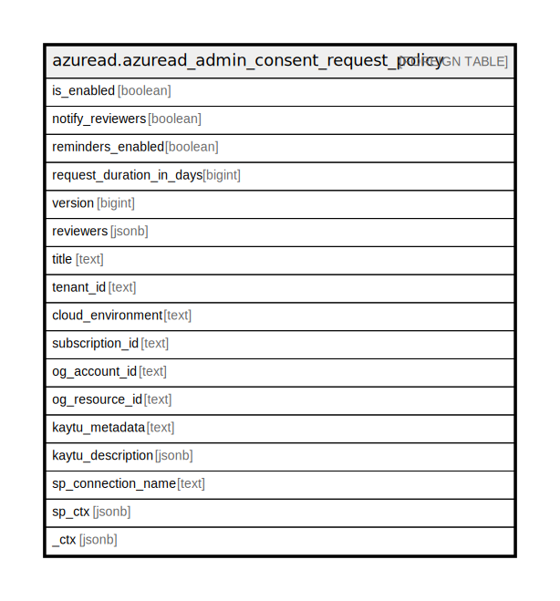

# azuread.azuread_admin_consent_request_policy

## Description

Represents the policy for enabling or disabling the Azure AD admin consent workflow.

## Columns

| Name | Type | Default | Nullable | Children | Parents | Comment |
| ---- | ---- | ------- | -------- | -------- | ------- | ------- |
| is_enabled | boolean |  | true |  |  | Specifies whether the admin consent request feature is enabled or disabled. |
| notify_reviewers | boolean |  | true |  |  | Specifies whether reviewers will receive notifications. |
| reminders_enabled | boolean |  | true |  |  | Specifies whether reviewers will receive reminder emails. |
| request_duration_in_days | bigint |  | true |  |  | Specifies the duration the request is active before it automatically expires if no decision is applied. |
| version | bigint |  | true |  |  | Specifies the version of this policy. When the policy is updated, this version is updated. |
| reviewers | jsonb |  | true |  |  | The list of reviewers for the admin consent. |
| title | text |  | true |  |  | Title of the resource. |
| tenant_id | text |  | true |  |  | The Azure Tenant ID where the resource is located. |
| cloud_environment | text |  | true |  |  |  |
| subscription_id | text |  | true |  |  |  |
| og_account_id | text |  | true |  |  | The Platform Account ID in which the resource is located. |
| og_resource_id | text |  | true |  |  | The unique ID of the resource in opengovernance. |
| kaytu_metadata | text |  | true |  |  |  |
| kaytu_description | jsonb |  | true |  |  | The full model description of the resource |
| sp_connection_name | text |  | true |  |  | Steampipe connection name. |
| sp_ctx | jsonb |  | true |  |  | Steampipe context in JSON form. |
| _ctx | jsonb |  | true |  |  | Steampipe context in JSON form. |

## Relations

---

> Generated by [tbls](https://github.com/k1LoW/tbls)
