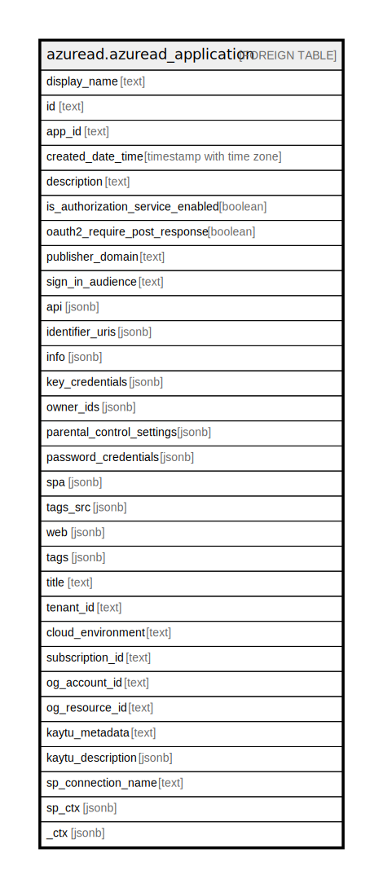

# azuread.azuread_application

## Description

Represents an Azure Active Directory (Azure AD) application.

## Columns

| Name | Type | Default | Nullable | Children | Parents | Comment |
| ---- | ---- | ------- | -------- | -------- | ------- | ------- |
| display_name | text |  | true |  |  | The display name for the application. |
| id | text |  | true |  |  | The unique identifier for the application. |
| app_id | text |  | true |  |  | The unique identifier for the application that is assigned to an application by Azure AD. |
| created_date_time | timestamp with time zone |  | true |  |  | The date and time the application was registered. The DateTimeOffset type represents date and time information using ISO 8601 format and is always in UTC time. |
| description | text |  | true |  |  | Free text field to provide a description of the application object to end users. |
| is_authorization_service_enabled | boolean |  | true |  |  | Is authorization service enabled. |
| oauth2_require_post_response | boolean |  | true |  |  | Specifies whether, as part of OAuth 2.0 token requests, Azure AD allows POST requests, as opposed to GET requests. The default is false, which specifies that only GET requests are allowed. |
| publisher_domain | text |  | true |  |  | The verified publisher domain for the application. |
| sign_in_audience | text |  | true |  |  | Specifies the Microsoft accounts that are supported for the current application. |
| api | jsonb |  | true |  |  | Specifies settings for an application that implements a web API. |
| identifier_uris | jsonb |  | true |  |  | The URIs that identify the application within its Azure AD tenant, or within a verified custom domain if the application is multi-tenant. |
| info | jsonb |  | true |  |  | Basic profile information of the application such as app's marketing, support, terms of service and privacy statement URLs. The terms of service and privacy statement are surfaced to users through the user consent experience. |
| key_credentials | jsonb |  | true |  |  | The collection of key credentials associated with the application. |
| owner_ids | jsonb |  | true |  |  | Id of the owners of the application. The owners are a set of non-admin users who are allowed to modify this object. |
| parental_control_settings | jsonb |  | true |  |  | Specifies parental control settings for an application. |
| password_credentials | jsonb |  | true |  |  | The collection of password credentials associated with the application. |
| spa | jsonb |  | true |  |  | Specifies settings for a single-page application, including sign out URLs and redirect URIs for authorization codes and access tokens. |
| tags_src | jsonb |  | true |  |  | Custom strings that can be used to categorize and identify the application. |
| web | jsonb |  | true |  |  | Specifies settings for a web application. |
| tags | jsonb |  | true |  |  | A map of tags for the resource. |
| title | text |  | true |  |  | Title of the resource. |
| tenant_id | text |  | true |  |  | The Azure Tenant ID where the resource is located. |
| cloud_environment | text |  | true |  |  |  |
| subscription_id | text |  | true |  |  |  |
| og_account_id | text |  | true |  |  | The Platform Account ID in which the resource is located. |
| og_resource_id | text |  | true |  |  | The unique ID of the resource in opengovernance. |
| kaytu_metadata | text |  | true |  |  |  |
| kaytu_description | jsonb |  | true |  |  | The full model description of the resource |
| sp_connection_name | text |  | true |  |  | Steampipe connection name. |
| sp_ctx | jsonb |  | true |  |  | Steampipe context in JSON form. |
| _ctx | jsonb |  | true |  |  | Steampipe context in JSON form. |

## Relations

---

> Generated by [tbls](https://github.com/k1LoW/tbls)
