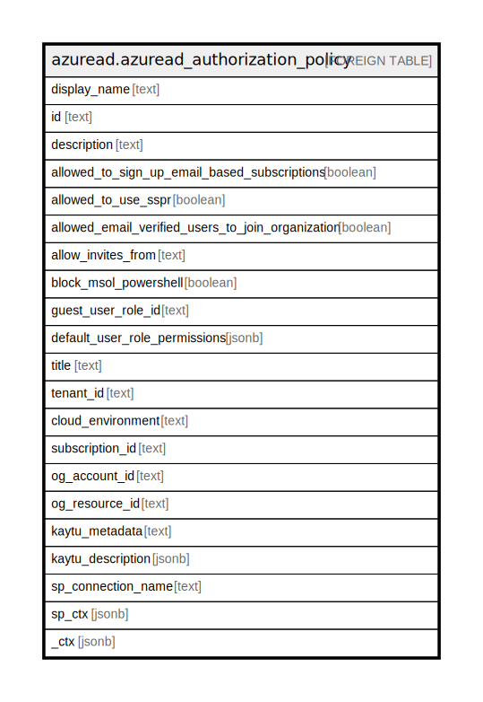

# azuread.azuread_authorization_policy

## Description

Represents a policy that can control Azure Active Directory authorization settings.

## Columns

| Name | Type | Default | Nullable | Children | Parents | Comment |
| ---- | ---- | ------- | -------- | -------- | ------- | ------- |
| display_name | text |  | true |  |  | Display name for this policy. |
| id | text |  | true |  |  | ID of the authorization policy. |
| description | text |  | true |  |  | Description of this policy. |
| allowed_to_sign_up_email_based_subscriptions | boolean |  | true |  |  | Indicates whether users can sign up for email based subscriptions. |
| allowed_to_use_sspr | boolean |  | true |  |  | Indicates whether the Self-Serve Password Reset feature can be used by users on the tenant. |
| allowed_email_verified_users_to_join_organization | boolean |  | true |  |  | Indicates whether a user can join the tenant by email validation. |
| allow_invites_from | text |  | true |  |  | Indicates who can invite external users to the organization. Possible values are: none, adminsAndGuestInviters, adminsGuestInvitersAndAllMembers, everyone. |
| block_msol_powershell | boolean |  | true |  |  | To disable the use of MSOL PowerShell set this property to true. This will also disable user-based access to the legacy service endpoint used by MSOL PowerShell. This does not affect Azure AD Connect or Microsoft Graph. |
| guest_user_role_id | text |  | true |  |  | Represents role templateId for the role that should be granted to guest user. |
| default_user_role_permissions | jsonb |  | true |  |  | Specifies certain customizable permissions for default user role. |
| title | text |  | true |  |  | Title of the resource. |
| tenant_id | text |  | true |  |  | The Azure Tenant ID where the resource is located. |
| cloud_environment | text |  | true |  |  |  |
| subscription_id | text |  | true |  |  |  |
| og_account_id | text |  | true |  |  | The Platform Account ID in which the resource is located. |
| og_resource_id | text |  | true |  |  | The unique ID of the resource in opengovernance. |
| kaytu_metadata | text |  | true |  |  |  |
| kaytu_description | jsonb |  | true |  |  | The full model description of the resource |
| sp_connection_name | text |  | true |  |  | Steampipe connection name. |
| sp_ctx | jsonb |  | true |  |  | Steampipe context in JSON form. |
| _ctx | jsonb |  | true |  |  | Steampipe context in JSON form. |

## Relations

---

> Generated by [tbls](https://github.com/k1LoW/tbls)
