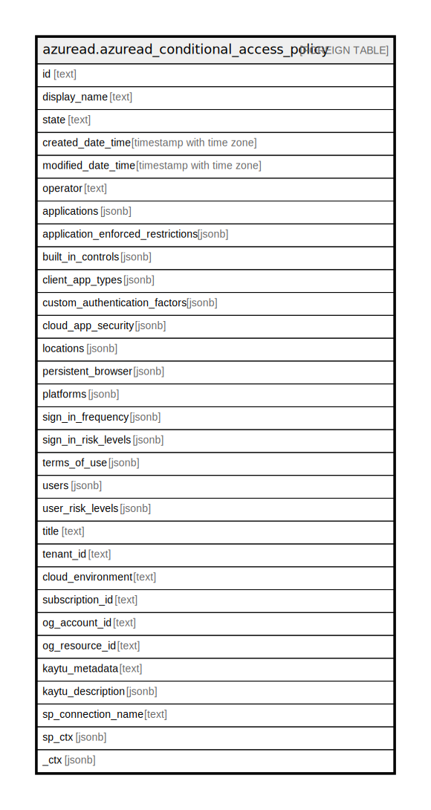

# azuread.azuread_conditional_access_policy

## Description

Represents an Azure Active Directory (Azure AD) Conditional Access Policy.

## Columns

| Name | Type | Default | Nullable | Children | Parents | Comment |
| ---- | ---- | ------- | -------- | -------- | ------- | ------- |
| id | text |  | true |  |  | Specifies the identifier of a conditionalAccessPolicy object. |
| display_name | text |  | true |  |  | Specifies a display name for the conditionalAccessPolicy object. |
| state | text |  | true |  |  | Specifies the state of the conditionalAccessPolicy object. Possible values are: enabled, disabled, enabledForReportingButNotEnforced. |
| created_date_time | timestamp with time zone |  | true |  |  | The create date of the conditional access policy. |
| modified_date_time | timestamp with time zone |  | true |  |  | The modification date of the conditional access policy. |
| operator | text |  | true |  |  | Defines the relationship of the grant controls. Possible values: AND, OR. |
| applications | jsonb |  | true |  |  | Applications and user actions included in and excluded from the policy. |
| application_enforced_restrictions | jsonb |  | true |  |  | Session control to enforce application restrictions. Only Exchange Online and Sharepoint Online support this session control. |
| built_in_controls | jsonb |  | true |  |  | List of values of built-in controls required by the policy. Possible values: block, mfa, compliantDevice, domainJoinedDevice, approvedApplication, compliantApplication, passwordChange, unknownFutureValue. |
| client_app_types | jsonb |  | true |  |  | Client application types included in the policy. Possible values are: all, browser, mobileAppsAndDesktopClients, exchangeActiveSync, easSupported, other. |
| custom_authentication_factors | jsonb |  | true |  |  | List of custom controls IDs required by the policy. |
| cloud_app_security | jsonb |  | true |  |  | Session control to apply cloud app security. |
| locations | jsonb |  | true |  |  | Locations included in and excluded from the policy. |
| persistent_browser | jsonb |  | true |  |  | Session control to define whether to persist cookies or not. All apps should be selected for this session control to work correctly. |
| platforms | jsonb |  | true |  |  | Platforms included in and excluded from the policy. |
| sign_in_frequency | jsonb |  | true |  |  | Session control to enforce signin frequency. |
| sign_in_risk_levels | jsonb |  | true |  |  | Sign-in risk levels included in the policy. Possible values are: low, medium, high, hidden, none, unknownFutureValue. |
| terms_of_use | jsonb |  | true |  |  | List of terms of use IDs required by the policy. |
| users | jsonb |  | true |  |  | Users, groups, and roles included in and excluded from the policy. |
| user_risk_levels | jsonb |  | true |  |  | User risk levels included in the policy. Possible values are: low, medium, high, hidden, none, unknownFutureValue. |
| title | text |  | true |  |  | Title of the resource. |
| tenant_id | text |  | true |  |  | The Azure Tenant ID where the resource is located. |
| cloud_environment | text |  | true |  |  |  |
| subscription_id | text |  | true |  |  |  |
| og_account_id | text |  | true |  |  | The Platform Account ID in which the resource is located. |
| og_resource_id | text |  | true |  |  | The unique ID of the resource in opengovernance. |
| kaytu_metadata | text |  | true |  |  |  |
| kaytu_description | jsonb |  | true |  |  | The full model description of the resource |
| sp_connection_name | text |  | true |  |  | Steampipe connection name. |
| sp_ctx | jsonb |  | true |  |  | Steampipe context in JSON form. |
| _ctx | jsonb |  | true |  |  | Steampipe context in JSON form. |

## Relations

---

> Generated by [tbls](https://github.com/k1LoW/tbls)
