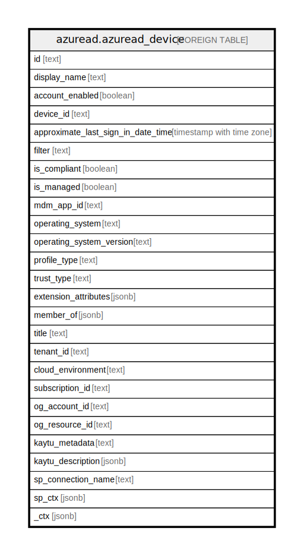

# azuread.azuread_device

## Description

Represents an Azure AD device.

## Columns

| Name | Type | Default | Nullable | Children | Parents | Comment |
| ---- | ---- | ------- | -------- | -------- | ------- | ------- |
| id | text |  | true |  |  | The unique identifier for the device. Inherited from directoryObject. |
| display_name | text |  | true |  |  | The name displayed for the device. |
| account_enabled | boolean |  | true |  |  | True if the account is enabled; otherwise, false. |
| device_id | text |  | true |  |  | Unique identifier set by Azure Device Registration Service at the time of registration. |
| approximate_last_sign_in_date_time | timestamp with time zone |  | true |  |  | The timestamp type represents date and time information using ISO 8601 format and is always in UTC time. |
| filter | text |  | true |  |  | Odata query to search for resources. |
| is_compliant | boolean |  | true |  |  | True if the device is compliant; otherwise, false. |
| is_managed | boolean |  | true |  |  | True if the device is managed; otherwise, false. |
| mdm_app_id | text |  | true |  |  | Application identifier used to register device into MDM. |
| operating_system | text |  | true |  |  | The type of operating system on the device. |
| operating_system_version | text |  | true |  |  | The version of the operating system on the device. |
| profile_type | text |  | true |  |  | A string value that can be used to classify device types. |
| trust_type | text |  | true |  |  | Type of trust for the joined device. Possible values: Workplace (indicates bring your own personal devices), AzureAd (Cloud only joined devices), ServerAd (on-premises domain joined devices joined to Azure AD). |
| extension_attributes | jsonb |  | true |  |  | Contains extension attributes 1-15 for the device. The individual extension attributes are not selectable. These properties are mastered in cloud and can be set during creation or update of a device object in Azure AD. |
| member_of | jsonb |  | true |  |  | A list the groups and directory roles that the device is a direct member of. |
| title | text |  | true |  |  | Title of the resource. |
| tenant_id | text |  | true |  |  | The Azure Tenant ID where the resource is located. |
| cloud_environment | text |  | true |  |  |  |
| subscription_id | text |  | true |  |  |  |
| og_account_id | text |  | true |  |  | The Platform Account ID in which the resource is located. |
| og_resource_id | text |  | true |  |  | The unique ID of the resource in opengovernance. |
| kaytu_metadata | text |  | true |  |  |  |
| kaytu_description | jsonb |  | true |  |  | The full model description of the resource |
| sp_connection_name | text |  | true |  |  | Steampipe connection name. |
| sp_ctx | jsonb |  | true |  |  | Steampipe context in JSON form. |
| _ctx | jsonb |  | true |  |  | Steampipe context in JSON form. |

## Relations

---

> Generated by [tbls](https://github.com/k1LoW/tbls)
