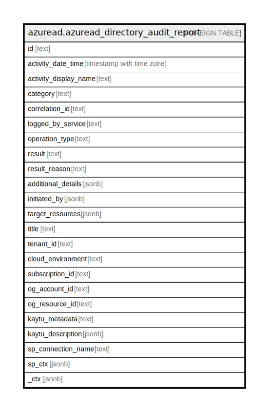

# azuread.azuread_directory_audit_report

## Description

Represents the list of audit logs generated by Azure Active Directory.

## Columns

| Name | Type | Default | Nullable | Children | Parents | Comment |
| ---- | ---- | ------- | -------- | -------- | ------- | ------- |
| id | text |  | true |  |  | Indicates the unique ID for the activity. |
| activity_date_time | timestamp with time zone |  | true |  |  | Indicates the date and time the activity was performed. |
| activity_display_name | text |  | true |  |  | Indicates the activity name or the operation name. |
| category | text |  | true |  |  | Indicates which resource category that's targeted by the activity. |
| correlation_id | text |  | true |  |  | Indicates a unique ID that helps correlate activities that span across various services. Can be used to trace logs across services. |
| logged_by_service | text |  | true |  |  | Indicates information on which service initiated the activity (For example: Self-service Password Management, Core Directory, B2C, Invited Users, Microsoft Identity Manager, Privileged Identity Management. |
| operation_type | text |  | true |  |  | Indicates the type of operation that was performed. The possible values include but are not limited to the following: Add, Assign, Update, Unassign, and Delete. |
| result | text |  | true |  |  | Indicates the result of the activity. Possible values are: success, failure, timeout, unknownFutureValue. |
| result_reason | text |  | true |  |  | Indicates the reason for failure if the result is failure or timeout. |
| additional_details | jsonb |  | true |  |  | Indicates additional details on the activity. |
| initiated_by | jsonb |  | true |  |  | Indicates information about the user or app initiated the activity. |
| target_resources | jsonb |  | true |  |  | Indicates information on which resource was changed due to the activity. Target Resource Type can be User, Device, Directory, App, Role, Group, Policy or Other. |
| title | text |  | true |  |  | Title of the resource. |
| tenant_id | text |  | true |  |  | The Azure Tenant ID where the resource is located. |
| cloud_environment | text |  | true |  |  |  |
| subscription_id | text |  | true |  |  |  |
| og_account_id | text |  | true |  |  | The Platform Account ID in which the resource is located. |
| og_resource_id | text |  | true |  |  | The unique ID of the resource in opengovernance. |
| kaytu_metadata | text |  | true |  |  |  |
| kaytu_description | jsonb |  | true |  |  | The full model description of the resource |
| sp_connection_name | text |  | true |  |  | Steampipe connection name. |
| sp_ctx | jsonb |  | true |  |  | Steampipe context in JSON form. |
| _ctx | jsonb |  | true |  |  | Steampipe context in JSON form. |

## Relations

---

> Generated by [tbls](https://github.com/k1LoW/tbls)
