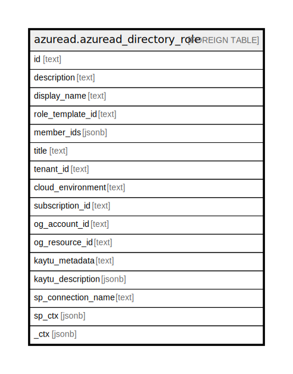

# azuread.azuread_directory_role

## Description

Represents an Azure Active Directory (Azure AD) directory role.

## Columns

| Name | Type | Default | Nullable | Children | Parents | Comment |
| ---- | ---- | ------- | -------- | -------- | ------- | ------- |
| id | text |  | true |  |  | The unique identifier for the directory role. |
| description | text |  | true |  |  | The description for the directory role. |
| display_name | text |  | true |  |  | The display name for the directory role. |
| role_template_id | text |  | true |  |  | The id of the directoryRoleTemplate that this role is based on. The property must be specified when activating a directory role in a tenant with a POST operation. After the directory role has been activated, the property is read only. |
| member_ids | jsonb |  | true |  |  | Id of the owners of the application. The owners are a set of non-admin users who are allowed to modify this object. |
| title | text |  | true |  |  | Title of the resource. |
| tenant_id | text |  | true |  |  | The Azure Tenant ID where the resource is located. |
| cloud_environment | text |  | true |  |  |  |
| subscription_id | text |  | true |  |  |  |
| og_account_id | text |  | true |  |  | The Platform Account ID in which the resource is located. |
| og_resource_id | text |  | true |  |  | The unique ID of the resource in opengovernance. |
| kaytu_metadata | text |  | true |  |  |  |
| kaytu_description | jsonb |  | true |  |  | The full model description of the resource |
| sp_connection_name | text |  | true |  |  | Steampipe connection name. |
| sp_ctx | jsonb |  | true |  |  | Steampipe context in JSON form. |
| _ctx | jsonb |  | true |  |  | Steampipe context in JSON form. |

## Relations

---

> Generated by [tbls](https://github.com/k1LoW/tbls)
