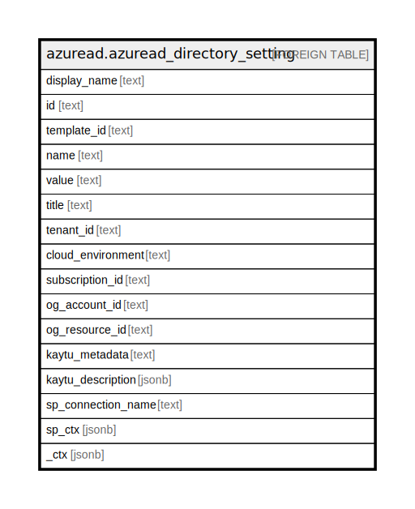

# azuread.azuread_directory_setting

## Description

Represents the configurations that can be used to customize the tenant-wide and object-specific restrictions and allowed behavior

## Columns

| Name | Type | Default | Nullable | Children | Parents | Comment |
| ---- | ---- | ------- | -------- | -------- | ------- | ------- |
| display_name | text |  | true |  |  | Display name of this group of settings, which comes from the associated template. |
| id | text |  | true |  |  | Unique identifier for these settings. |
| template_id | text |  | true |  |  | Unique identifier for the template used to create this group of settings. |
| name | text |  | true |  |  | Name of the setting. |
| value | text |  | true |  |  | Value of the setting. |
| title | text |  | true |  |  | Title of the resource. |
| tenant_id | text |  | true |  |  | The Azure Tenant ID where the resource is located. |
| cloud_environment | text |  | true |  |  |  |
| subscription_id | text |  | true |  |  |  |
| og_account_id | text |  | true |  |  | The Platform Account ID in which the resource is located. |
| og_resource_id | text |  | true |  |  | The unique ID of the resource in opengovernance. |
| kaytu_metadata | text |  | true |  |  |  |
| kaytu_description | jsonb |  | true |  |  | The full model description of the resource |
| sp_connection_name | text |  | true |  |  | Steampipe connection name. |
| sp_ctx | jsonb |  | true |  |  | Steampipe context in JSON form. |
| _ctx | jsonb |  | true |  |  | Steampipe context in JSON form. |

## Relations

---

> Generated by [tbls](https://github.com/k1LoW/tbls)
