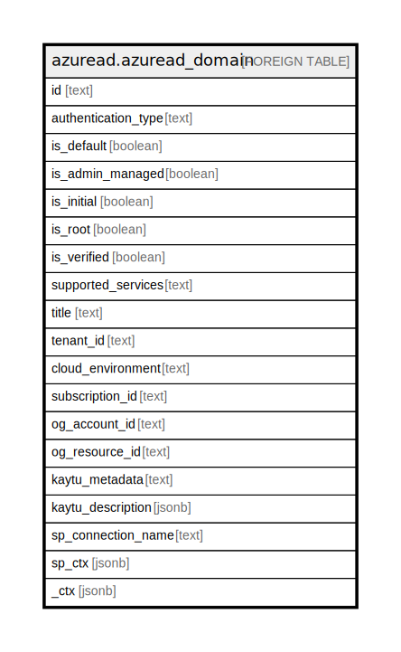

# azuread.azuread_domain

## Description

Represents an Azure Active Directory (Azure AD) domain.

## Columns

| Name | Type | Default | Nullable | Children | Parents | Comment |
| ---- | ---- | ------- | -------- | -------- | ------- | ------- |
| id | text |  | true |  |  | The fully qualified name of the domain. |
| authentication_type | text |  | true |  |  | Indicates the configured authentication type for the domain. The value is either Managed or Federated. Managed indicates a cloud managed domain where Azure AD performs user authentication. Federated indicates authentication is federated with an identity provider such as the tenant's on-premises Active Directory via Active Directory Federation Services. |
| is_default | boolean |  | true |  |  | true if this is the default domain that is used for user creation. There is only one default domain per company. |
| is_admin_managed | boolean |  | true |  |  | The value of the property is false if the DNS record management of the domain has been delegated to Microsoft 365. Otherwise, the value is true. |
| is_initial | boolean |  | true |  |  | true if this is the initial domain created by Microsoft Online Services (companyname.onmicrosoft.com). There is only one initial domain per company. |
| is_root | boolean |  | true |  |  | true if the domain is a verified root domain. Otherwise, false if the domain is a subdomain or unverified. |
| is_verified | boolean |  | true |  |  | true if the domain has completed domain ownership verification. |
| supported_services | text |  | true |  |  | The capabilities assigned to the domain. Can include 0, 1 or more of following values: Email, Sharepoint, EmailInternalRelayOnly, OfficeCommunicationsOnline, SharePointDefaultDomain, FullRedelegation, SharePointPublic, OrgIdAuthentication, Yammer, Intune. The values which you can add/remove using Graph API include: Email, OfficeCommunicationsOnline, Yammer. |
| title | text |  | true |  |  | Title of the resource. |
| tenant_id | text |  | true |  |  | The Azure Tenant ID where the resource is located. |
| cloud_environment | text |  | true |  |  |  |
| subscription_id | text |  | true |  |  |  |
| og_account_id | text |  | true |  |  | The Platform Account ID in which the resource is located. |
| og_resource_id | text |  | true |  |  | The unique ID of the resource in opengovernance. |
| kaytu_metadata | text |  | true |  |  |  |
| kaytu_description | jsonb |  | true |  |  | The full model description of the resource |
| sp_connection_name | text |  | true |  |  | Steampipe connection name. |
| sp_ctx | jsonb |  | true |  |  | Steampipe context in JSON form. |
| _ctx | jsonb |  | true |  |  | Steampipe context in JSON form. |

## Relations

---

> Generated by [tbls](https://github.com/k1LoW/tbls)
