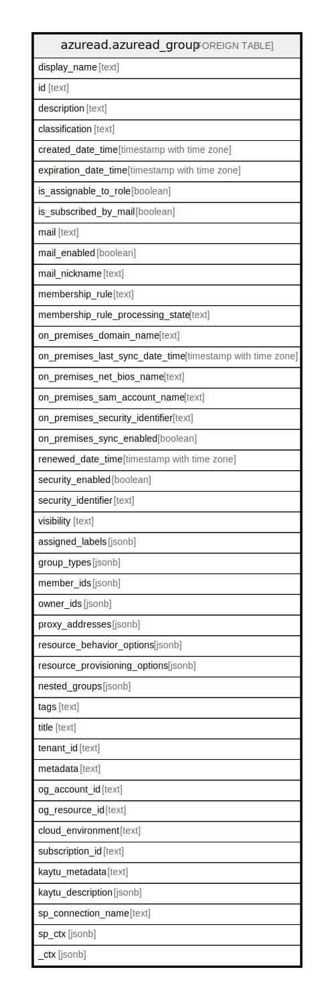

# azuread.azuread_group

## Description

Represents an Azure AD group.

## Columns

| Name | Type | Default | Nullable | Children | Parents | Comment |
| ---- | ---- | ------- | -------- | -------- | ------- | ------- |
| display_name | text |  | true |  |  | The name displayed in the address book for the user. This is usually the combination of the user's first name, middle initial and last name. |
| id | text |  | true |  |  | The unique identifier for the group. |
| description | text |  | true |  |  | An optional description for the group. |
| classification | text |  | true |  |  | Describes a classification for the group (such as low, medium or high business impact). |
| created_date_time | timestamp with time zone |  | true |  |  | The time at which the group was created. |
| expiration_date_time | timestamp with time zone |  | true |  |  | Timestamp of when the group is set to expire. |
| is_assignable_to_role | boolean |  | true |  |  | Indicates whether this group can be assigned to an Azure Active Directory role or not. |
| is_subscribed_by_mail | boolean |  | true |  |  | Indicates whether the signed-in user is subscribed to receive email conversations. Default value is true. |
| mail | text |  | true |  |  | The SMTP address for the group, for example, "serviceadmins@contoso.onmicrosoft.com". |
| mail_enabled | boolean |  | true |  |  | Specifies whether the group is mail-enabled. |
| mail_nickname | text |  | true |  |  | The mail alias for the user. |
| membership_rule | text |  | true |  |  | The mail alias for the group, unique in the organization. |
| membership_rule_processing_state | text |  | true |  |  | Indicates whether the dynamic membership processing is on or paused. Possible values are On or Paused. |
| on_premises_domain_name | text |  | true |  |  | Contains the on-premises Domain name synchronized from the on-premises directory. |
| on_premises_last_sync_date_time | timestamp with time zone |  | true |  |  | Indicates the last time at which the group was synced with the on-premises directory. |
| on_premises_net_bios_name | text |  | true |  |  | Contains the on-premises NetBiosName synchronized from the on-premises directory. |
| on_premises_sam_account_name | text |  | true |  |  | Contains the on-premises SAM account name synchronized from the on-premises directory. |
| on_premises_security_identifier | text |  | true |  |  | Contains the on-premises security identifier (SID) for the group that was synchronized from on-premises to the cloud. |
| on_premises_sync_enabled | boolean |  | true |  |  | True if this group is synced from an on-premises directory; false if this group was originally synced from an on-premises directory but is no longer synced; null if this object has never been synced from an on-premises directory (default). |
| renewed_date_time | timestamp with time zone |  | true |  |  | Timestamp of when the group was last renewed. This cannot be modified directly and is only updated via the renew service action. |
| security_enabled | boolean |  | true |  |  | Specifies whether the group is a security group. |
| security_identifier | text |  | true |  |  | Security identifier of the group, used in Windows scenarios. |
| visibility | text |  | true |  |  | Specifies the group join policy and group content visibility for groups. Possible values are: Private, Public, or Hiddenmembership. |
| assigned_labels | jsonb |  | true |  |  | The list of sensitivity label pairs (label ID, label name) associated with a Microsoft 365 group. |
| group_types | jsonb |  | true |  |  | Specifies the group type and its membership. If the collection contains Unified, the group is a Microsoft 365 group; otherwise, it's either a security group or distribution group. For details, see [groups overview](https://docs.microsoft.com/en-us/graph/api/resources/groups-overview?view=graph-rest-1.0). |
| member_ids | jsonb |  | true |  |  | Id of Users and groups that are members of this group. |
| owner_ids | jsonb |  | true |  |  | Id od the owners of the group. The owners are a set of non-admin users who are allowed to modify this object. |
| proxy_addresses | jsonb |  | true |  |  | Email addresses for the group that direct to the same group mailbox. For example: ["SMTP: bob@contoso.com", "smtp: bob@sales.contoso.com"]. The any operator is required to filter expressions on multi-valued properties. |
| resource_behavior_options | jsonb |  | true |  |  | Specifies the group behaviors that can be set for a Microsoft 365 group during creation. Possible values are AllowOnlyMembersToPost, HideGroupInOutlook, SubscribeNewGroupMembers, WelcomeEmailDisabled. |
| resource_provisioning_options | jsonb |  | true |  |  | Specifies the group resources that are provisioned as part of Microsoft 365 group creation, that are not normally part of default group creation. Possible value is Team. |
| nested_groups | jsonb |  | true |  |  | Members which are group. |
| tags | text |  | true |  |  | A map of tags for the resource. |
| title | text |  | true |  |  | Title of the resource. |
| tenant_id | text |  | true |  |  | The Azure Tenant ID where the resource is located. |
| metadata | text |  | true |  |  | Metadata of the Azure resource |
| og_account_id | text |  | true |  |  | The Platform Account ID in which the resource is located. |
| og_resource_id | text |  | true |  |  | The unique ID of the resource in opengovernance. |
| cloud_environment | text |  | true |  |  |  |
| subscription_id | text |  | true |  |  |  |
| kaytu_metadata | text |  | true |  |  |  |
| kaytu_description | jsonb |  | true |  |  | The full model description of the resource |
| sp_connection_name | text |  | true |  |  | Steampipe connection name. |
| sp_ctx | jsonb |  | true |  |  | Steampipe context in JSON form. |
| _ctx | jsonb |  | true |  |  | Steampipe context in JSON form. |

## Relations

---

> Generated by [tbls](https://github.com/k1LoW/tbls)
