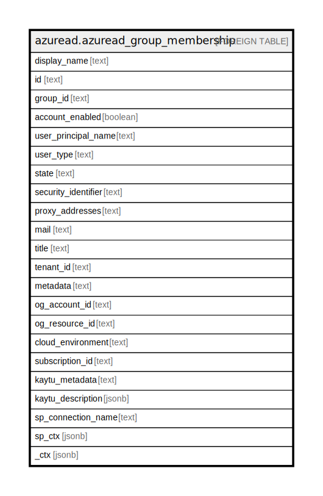

# azuread.azuread_group_membership

## Description

Represents an Azure AD group membership.

## Columns

| Name | Type | Default | Nullable | Children | Parents | Comment |
| ---- | ---- | ------- | -------- | -------- | ------- | ------- |
| display_name | text |  | true |  |  | The name displayed in the address book for the user. This is usually the combination of the user's first name, middle initial and last name. |
| id | text |  | true |  |  | The unique identifier for the user. |
| group_id | text |  | true |  |  | The group id. |
| account_enabled | boolean |  | true |  |  | is the account enabled or not |
| user_principal_name | text |  | true |  |  | user principal name. |
| user_type | text |  | true |  |  | user type. |
| state | text |  | true |  |  | state. |
| security_identifier | text |  | true |  |  | state. |
| proxy_addresses | text |  | true |  |  | user proxy addresses. |
| mail | text |  | true |  |  | user email. |
| title | text |  | true |  |  | Title of the resource. |
| tenant_id | text |  | true |  |  | The Azure Tenant ID where the resource is located. |
| metadata | text |  | true |  |  | Metadata of the Azure resource |
| og_account_id | text |  | true |  |  | The Platform Account ID in which the resource is located. |
| og_resource_id | text |  | true |  |  | The unique ID of the resource in opengovernance. |
| cloud_environment | text |  | true |  |  |  |
| subscription_id | text |  | true |  |  |  |
| kaytu_metadata | text |  | true |  |  |  |
| kaytu_description | jsonb |  | true |  |  | The full model description of the resource |
| sp_connection_name | text |  | true |  |  | Steampipe connection name. |
| sp_ctx | jsonb |  | true |  |  | Steampipe context in JSON form. |
| _ctx | jsonb |  | true |  |  | Steampipe context in JSON form. |

## Relations

---

> Generated by [tbls](https://github.com/k1LoW/tbls)
