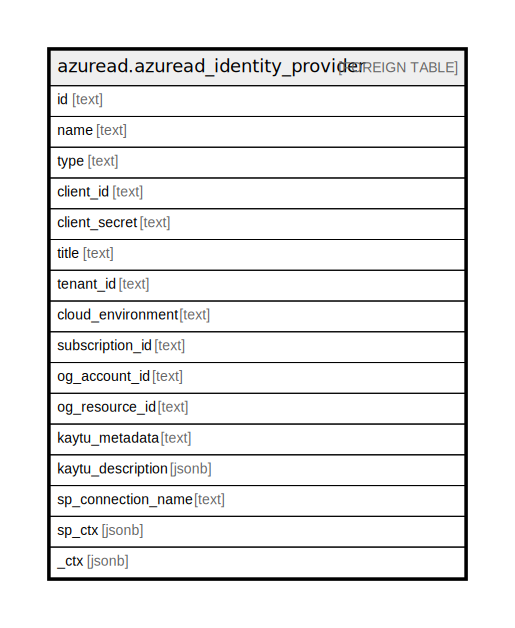

# azuread.azuread_identity_provider

## Description

Represents an Azure Active Directory (Azure AD) identity provider.

## Columns

| Name | Type | Default | Nullable | Children | Parents | Comment |
| ---- | ---- | ------- | -------- | -------- | ------- | ------- |
| id | text |  | true |  |  | The ID of the identity provider. |
| name | text |  | true |  |  | The display name of the identity provider. |
| type | text |  | true |  |  | The identity provider type is a required field. For B2B scenario: Google, Facebook. For B2C scenario: Microsoft, Google, Amazon, LinkedIn, Facebook, GitHub, Twitter, Weibo, QQ, WeChat, OpenIDConnect. |
| client_id | text |  | true |  |  | The client ID for the application. This is the client ID obtained when registering the application with the identity provider. |
| client_secret | text |  | true |  |  | The client secret for the application. This is the client secret obtained when registering the application with the identity provider. This is write-only. A read operation will return ****. |
| title | text |  | true |  |  | Title of the resource. |
| tenant_id | text |  | true |  |  | The Azure Tenant ID where the resource is located. |
| cloud_environment | text |  | true |  |  |  |
| subscription_id | text |  | true |  |  |  |
| og_account_id | text |  | true |  |  | The Platform Account ID in which the resource is located. |
| og_resource_id | text |  | true |  |  | The unique ID of the resource in opengovernance. |
| kaytu_metadata | text |  | true |  |  |  |
| kaytu_description | jsonb |  | true |  |  | The full model description of the resource |
| sp_connection_name | text |  | true |  |  | Steampipe connection name. |
| sp_ctx | jsonb |  | true |  |  | Steampipe context in JSON form. |
| _ctx | jsonb |  | true |  |  | Steampipe context in JSON form. |

## Relations

---

> Generated by [tbls](https://github.com/k1LoW/tbls)
