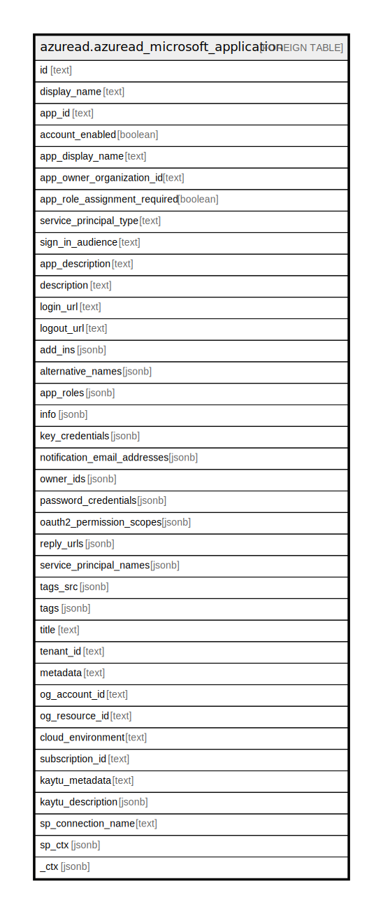

# azuread.azuread_microsoft_application

## Description

Represents an Azure Microsoft Application.

## Columns

| Name | Type | Default | Nullable | Children | Parents | Comment |
| ---- | ---- | ------- | -------- | -------- | ------- | ------- |
| id | text |  | true |  |  | The unique identifier for the service principal. |
| display_name | text |  | true |  |  | The display name for the service principal. |
| app_id | text |  | true |  |  | The unique identifier for the associated application (its appId property). |
| account_enabled | boolean |  | true |  |  | true if the service principal account is enabled; otherwise, false. |
| app_display_name | text |  | true |  |  | The display name exposed by the associated application. |
| app_owner_organization_id | text |  | true |  |  | Contains the tenant id where the application is registered. This is applicable only to service principals backed by applications. |
| app_role_assignment_required | boolean |  | true |  |  | Specifies whether users or other service principals need to be granted an app role assignment for this service principal before users can sign in or apps can get tokens. The default value is false. |
| service_principal_type | text |  | true |  |  | Identifies whether the service principal represents an application, a managed identity, or a legacy application. This is set by Azure AD internally. |
| sign_in_audience | text |  | true |  |  | Specifies the Microsoft accounts that are supported for the current application. Supported values are: AzureADMyOrg, AzureADMultipleOrgs, AzureADandPersonalMicrosoftAccount, PersonalMicrosoftAccount. |
| app_description | text |  | true |  |  | The description exposed by the associated application. |
| description | text |  | true |  |  | Free text field to provide an internal end-user facing description of the service principal. |
| login_url | text |  | true |  |  | Specifies the URL where the service provider redirects the user to Azure AD to authenticate. Azure AD uses the URL to launch the application from Microsoft 365 or the Azure AD My Apps. When blank, Azure AD performs IdP-initiated sign-on for applications configured with SAML-based single sign-on. |
| logout_url | text |  | true |  |  | Specifies the URL that will be used by Microsoft's authorization service to logout an user using OpenId Connect front-channel, back-channel or SAML logout protocols. |
| add_ins | jsonb |  | true |  |  | Defines custom behavior that a consuming service can use to call an app in specific contexts. |
| alternative_names | jsonb |  | true |  |  | Used to retrieve service principals by subscription, identify resource group and full resource ids for managed identities. |
| app_roles | jsonb |  | true |  |  | The roles exposed by the application which this service principal represents. |
| info | jsonb |  | true |  |  | Basic profile information of the acquired application such as app's marketing, support, terms of service and privacy statement URLs. |
| key_credentials | jsonb |  | true |  |  | The collection of key credentials associated with the service principal. |
| notification_email_addresses | jsonb |  | true |  |  | Specifies the list of email addresses where Azure AD sends a notification when the active certificate is near the expiration date. This is only for the certificates used to sign the SAML token issued for Azure AD Gallery applications. |
| owner_ids | jsonb |  | true |  |  | Id of the owners of the application. The owners are a set of non-admin users who are allowed to modify this object. |
| password_credentials | jsonb |  | true |  |  | Represents a password credential associated with a service principal. |
| oauth2_permission_scopes | jsonb |  | true |  |  | The published permission scopes. |
| reply_urls | jsonb |  | true |  |  | The URLs that user tokens are sent to for sign in with the associated application, or the redirect URIs that OAuth 2.0 authorization codes and access tokens are sent to for the associated application. |
| service_principal_names | jsonb |  | true |  |  | Contains the list of identifiersUris, copied over from the associated application. Additional values can be added to hybrid applications. These values can be used to identify the permissions exposed by this app within Azure AD. |
| tags_src | jsonb |  | true |  |  | Custom strings that can be used to categorize and identify the service principal. |
| tags | jsonb |  | true |  |  | A map of tags for the resource. |
| title | text |  | true |  |  | Title of the resource. |
| tenant_id | text |  | true |  |  | The Azure Tenant ID where the resource is located. |
| metadata | text |  | true |  |  | Metadata of the Azure resource |
| og_account_id | text |  | true |  |  | The Platform Account ID in which the resource is located. |
| og_resource_id | text |  | true |  |  | The unique ID of the resource in opengovernance. |
| cloud_environment | text |  | true |  |  |  |
| subscription_id | text |  | true |  |  |  |
| kaytu_metadata | text |  | true |  |  |  |
| kaytu_description | jsonb |  | true |  |  | The full model description of the resource |
| sp_connection_name | text |  | true |  |  | Steampipe connection name. |
| sp_ctx | jsonb |  | true |  |  | Steampipe context in JSON form. |
| _ctx | jsonb |  | true |  |  | Steampipe context in JSON form. |

## Relations

---

> Generated by [tbls](https://github.com/k1LoW/tbls)
