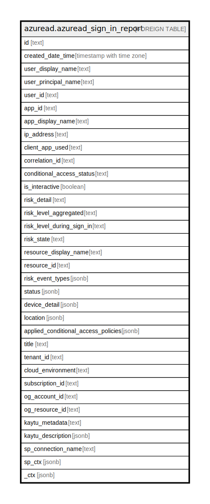

# azuread.azuread_sign_in_report

## Description

Represents an Azure Active Directory (Azure AD) sign-in report.

## Columns

| Name | Type | Default | Nullable | Children | Parents | Comment |
| ---- | ---- | ------- | -------- | -------- | ------- | ------- |
| id | text |  | true |  |  | Unique ID representing the sign-in activity. |
| created_date_time | timestamp with time zone |  | true |  |  | Date and time (UTC) the sign-in was initiated. |
| user_display_name | text |  | true |  |  | Display name of the user that initiated the sign-in. |
| user_principal_name | text |  | true |  |  | User principal name of the user that initiated the sign-in. |
| user_id | text |  | true |  |  | ID of the user that initiated the sign-in. |
| app_id | text |  | true |  |  | Unique GUID representing the app ID in the Azure Active Directory. |
| app_display_name | text |  | true |  |  | App name displayed in the Azure Portal. |
| ip_address | text |  | true |  |  | IP address of the client used to sign in. |
| client_app_used | text |  | true |  |  | Identifies the legacy client used for sign-in activity. |
| correlation_id | text |  | true |  |  | The request ID sent from the client when the sign-in is initiated; used to troubleshoot sign-in activity. |
| conditional_access_status | text |  | true |  |  | Reports status of an activated conditional access policy. Possible values are: success, failure, notApplied, and unknownFutureValue. |
| is_interactive | boolean |  | true |  |  | Indicates if a sign-in is interactive or not. |
| risk_detail | text |  | true |  |  | Provides the 'reason' behind a specific state of a risky user, sign-in or a risk event. The possible values are: none, adminGeneratedTemporaryPassword, userPerformedSecuredPasswordChange, userPerformedSecuredPasswordReset, adminConfirmedSigninSafe, aiConfirmedSigninSafe, userPassedMFADrivenByRiskBasedPolicy, adminDismissedAllRiskForUser, adminConfirmedSigninCompromised, unknownFutureValue. |
| risk_level_aggregated | text |  | true |  |  | Aggregated risk level. The possible values are: none, low, medium, high, hidden, and unknownFutureValue. |
| risk_level_during_sign_in | text |  | true |  |  | Risk level during sign-in. The possible values are: none, low, medium, high, hidden, and unknownFutureValue. |
| risk_state | text |  | true |  |  | Reports status of the risky user, sign-in, or a risk event. The possible values are: none, confirmedSafe, remediated, dismissed, atRisk, confirmedCompromised, unknownFutureValue. |
| resource_display_name | text |  | true |  |  | Name of the resource the user signed into. |
| resource_id | text |  | true |  |  | ID of the resource that the user signed into. |
| risk_event_types | jsonb |  | true |  |  | Risk event types associated with the sign-in. The possible values are: unlikelyTravel, anonymizedIPAddress, maliciousIPAddress, unfamiliarFeatures, malwareInfectedIPAddress, suspiciousIPAddress, leakedCredentials, investigationsThreatIntelligence, generic, and unknownFutureValue. |
| status | jsonb |  | true |  |  | Sign-in status. Includes the error code and description of the error (in case of a sign-in failure). |
| device_detail | jsonb |  | true |  |  | Device information from where the sign-in occurred; includes device ID, operating system, and browser. |
| location | jsonb |  | true |  |  | Provides the city, state, and country code where the sign-in originated. |
| applied_conditional_access_policies | jsonb |  | true |  |  | Provides a list of conditional access policies that are triggered by the corresponding sign-in activity. |
| title | text |  | true |  |  | Title of the resource. |
| tenant_id | text |  | true |  |  | The Azure Tenant ID where the resource is located. |
| cloud_environment | text |  | true |  |  |  |
| subscription_id | text |  | true |  |  |  |
| og_account_id | text |  | true |  |  | The Platform Account ID in which the resource is located. |
| og_resource_id | text |  | true |  |  | The unique ID of the resource in opengovernance. |
| kaytu_metadata | text |  | true |  |  |  |
| kaytu_description | jsonb |  | true |  |  | The full model description of the resource |
| sp_connection_name | text |  | true |  |  | Steampipe connection name. |
| sp_ctx | jsonb |  | true |  |  | Steampipe context in JSON form. |
| _ctx | jsonb |  | true |  |  | Steampipe context in JSON form. |

## Relations

---

> Generated by [tbls](https://github.com/k1LoW/tbls)
